<!--
version:  2024.12.04.01

author:   Dr. Manuela Ulrich, Dr. Sebastian Tillmann, Sarah Roos, Michael Kowalczyk

email:    teacheredu.euniwell@uni-konstanz.de

comment:  Self-study Module about Diversity & Inclusion in Education
          
logo:     https://euniwell.de.cool/wp-content/uploads/liascript/images/euniwell-oer-cc-header.svg 

icon:     https://euniwell.de.cool/wp-content/uploads/liascript/images/euniwell-oer-cc-header.svg

language: en

narrator: English Female

mode:     Textbook
dark:     false

date:     04/12/2024

attribute: The OER self-study module Diversity and Inclusion in Education from the European University for Well-Being is licensed under the Creative Commons Attribution-ShareAlike 4.0 International License.

  

translateWithGoogle: true

@onload
const showFootnote = window.LIA.showFootnote

window.LIA.showFootnote = (ref) => {
  if (window.LIA.settings.mode === "Textbook") {
    document.getElementById("footnote-" + ref).scrollIntoView()
  } else {
    showFootnote(ref)
  }
}
@end

script:  https://h5p.org/sites/all/modules/h5p/library/js/h5p-resizer.js

@h5p_embed: @h5p_embed_(@uid,@0)

@h5p_embed_
<iframe id="h5p_@0" style="width:100%;" srcdoc='<!DOCTYPE html><html lang="de"><head><meta charset="UTF-8"><meta name="viewport" content="width=device-width, initial-scale=1.0"></head><body>

</body></html>'></iframe>

@end

@style
.admonition {
    padding: 15px 20px;
    margin-bottom: 20px;
    border: 1px solid transparent;
    border-radius: 4px;
    box-shadow: 0 1px 1px rgba(0,0,0,0.05);
    position: relative;
    line-height: 1.4;
}
.admonition::before {
    margin-left: -5rem;
}
.admonition.note {
    color: #31708f;
    background-color: #d9edf7;
    border-left: 5px solid #31708f;
}
.admonition.warning {
    color: #8a6d3b;
    background-color: #fcf8e3;
    border-left: 5px solid #8a6d3b;
}
.admonition.danger {
    color: #a94442;
    background-color: #f2dede;
    border-left: 5px solid #a94442;
}
.admonition-title {
    font-weight: bold;
    margin-bottom: 10px;
}
@end

@admonition: @admonition_(@uid,@0,@1)

@admonition_: 

-->

# EUniWell OER self-study module _Diversity and Inclusion in Education_

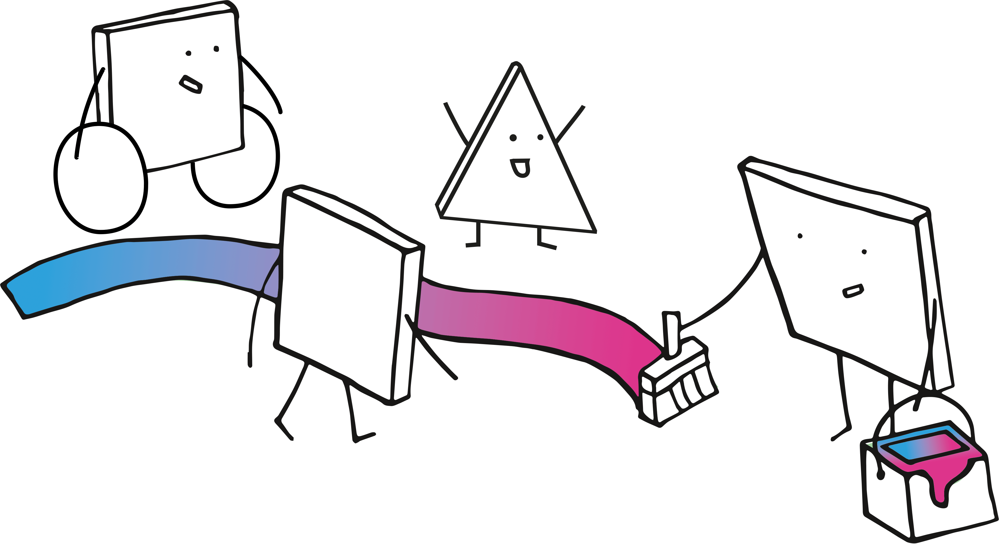

> "People who want inclusion look for ways to make it happen, and people who don't want it look for rationalizations."
>
> -- Hubert Hüppe, Member of the German Bundestag, former German Federal Government Commissioner for Matters relating to Persons with Disabilities.[^1]

---

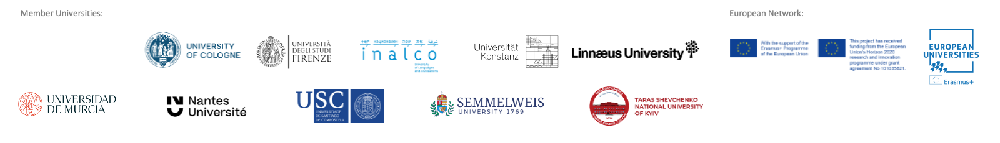

---

[^1]: V. Aichele, LL.M., S. Bernot, C. Hübner, S. Kroworsch, B.Leisering, P. Litschke, L. Palleit, K. Pöllmann, J. Striek. (2019). Wer Inklusion will, sucht Wege - Zehn Jahre UN-Behindertenrechtskonvention in Deutschland. Deutsche Institut für Menschenrechte, Monitoring-Stelle UN-Behindertenrechtskonvention. https://www.institut-fuer-menschenrechte.de/fileadmin/Redaktion/Publikationen/Wer_Inklusion_will_sucht_Wege_Zehn_Jahre_UN_BRK_in_Deutschland.pdf Own translation.

## About this OER
The OER self-study module _Diversity and Inclusion in Education_ aims to foster the development of fundamental competences in the field of diversity and inclusion in education.

It was developed as part of Work Package 6 of the [European University for Well-Being (EUniWell)](#6) project at the University of Konstanz.

Target Group
----------
This OER self-study module is primarily aimed at student teachers, but is also open to in-service teachers and a broader audience in education.

No prior knowledge is required
-------------------------------------------

[Chapter Overview & Learning Goals](#3)
------------------------

Duration
----------------
This OER self-study module takes between 7 and 9 hours to complete.

Certificate of Participation
-------------------
  
A certificate of participation is available to participants who pass the final examination at the end of the module (with 80% or more correct answers).

Accessibility Commitment Statement
---------------------------

We aim to ensure that this Open Educational Resource (OER) adheres to the [WCAG 2.1 Level AA guidelines](https://developer.mozilla.org/en-US/docs/Web/Accessibility/Understanding_WCAG) to the greatest extent possible.

While we strive to meet the criteria outlined for Levels A and AA compliance, please be aware that [LiaScript](https://liascript.github.io/), the main authoring software used for this OER, does not provide specific information regarding accessibility compliance.

We integrate interactive [H5P](https://h5p.org/) modules and use those which are not marked as not accessible in the [H5P Content types recommendations list](https://help.h5p.com/hc/en-us/articles/7505649072797-Content-types-recommendations).

Feedback
---------
We are committed to continuous improvement and welcome [anonymous feedback](https://padlet.com/teacheredueuniwell/public-feedback-for-euniwell-oer-diversity-inclusion-t9twf0p8n7gd2wo3) on our public feedback wall to discuss and enhance the content quality and accessibility of the OER.

Authors
--------

This OER self-study module was produced by the University of Konstanz project team as part of the EUniWell project, funded by the European Union.

OER Project Team: 

* [Sarah Roos](mailto:sarah.roos@uni-konstanz.de) (Project Coordination)
* [Dr. des. Manuela Ulrich](https://www.bildungsforschung.uni-konstanz.de/dr-manuela-ulrich/) (Diversity & Inclusion)
* [Dr. Sebastian Tillmann](https://www.exc.uni-konstanz.de/en/ungleichheit/ueber-uns/personen/alle-clustermitglieder/tillmann-sebastian/) (Chapter 7. Unconscious Bias)
* [Michael Kowalczyk](mailto:michael.kowalczyk@uni-konstanz.de) (Educational Media)

Acknowledgements:

* Samantha Jacobs (Student Assistant)
* The case vignettes were created by teacher education master’s students during the 2024 summer semester at the University of Konstanz.

The Chapter Header Illustrations are by [Manfred Steger](https://pixabay.com/de/users/1848497/) published under the [Pixabay Content License](https://pixabay.com/service/license-summary/).

Contact
--------

Email: [teacheredu.euniwell@uni-konstanz.de](mailto:teacheredu.euniwell@uni-konstanz.de)

Creative Commons License
------------------------

The OER self-study module _Diversity and Inclusion in Education_ from the European University for Well-Being is licensed under the [Creative Commons Attribution-ShareAlike 4.0 International License](https://creativecommons.org/licenses/by-sa/4.0/deed.en).

You are free to share, remix, adapt, and build upon the work, even for commercial purposes, as long as you credit the original creator and license your new creations under the same or a [compatible license](https://creativecommons.org/share-your-work/licensing-considerations/compatible-licenses/).

Use the [CC-Mixer](https://ccmixer.edu-sharing.org/) to check for Creative-Commons license compatibility.

Download
-------------- 

This EUniWell OER self-study module "Diversity and Inclusion" will be available for download after approval by the project sponsor in following data formats:

* ZIP package containing all project files (md,png,jpg,h5p, pptx)
* SCORM 2004 zip file 

### Chapters, Key Themes and Learning Goals

> [__About this OER__](#2)

> [__About the EUniWell Project__](#5)

> [__UNESCO Global education report on inclusion and education__](#8)

> [__Chapter 1 - Systems Theory Perspectives__](#9)
>
> Social structures and global influences determine inclusion and inclusive education in our constantly evolving societies; this framework influences institutions and interactions and shapes the perceptions and identities of groups and individuals. With regard to the aims of inclusion and quality education, we should see the individual in the middle of society. Furthermore, we should look at the everyday interactions in our nearest socio-ecological environments and remind ourselves that thinking and acting in inclusive ways is everyone's responsibility.
> 
> __Learning Goals__
>
> * You are able to describe the significance of inclusive education and its impact on society.
> * You are able to explain the application of systems theory to the school system (including multi-level and ecosystemic models).
> * You are able to describe how symbolic interactionism explains social behaviors related to inclusion. 

> [__Chapter 2 - Discrimination, Diversity and Inclusion__](#14)
> 
> People have different characteristics in various social, biological, and psychological dimensions and act differently in their interactions with others. This can lead to discriminatory situations. Looking at the historical development of diversity as well as inclusion and their definitions (and at the problems involved in finding value-free descriptions of the phenomena) reveals that concepts and terms such as diversity, integration, and inclusion have shifted over time. Some researchers refer to a paradigm shift that has taken place in modern society.
>
> __Learning Goals__
>
> * You are able to provide basic definitions of diversity and inclusion and to delineate related concepts such as exclusion, separation, and integration.
> * You are able to describe forms of discrimination.

> [__Chapter 3 - Inclusion in Global Legal Foundations__](#18)
>
> With the help of global cooperation, international legal frameworks (e.g. the Universal Declaration of Human Rightshuman rights convention) and national ratificationrights (e.g. of the ratification of the UN Convention on the Rights of Persons with Disabilities (CRPD), in Germany in 2009) have been agreed over time to ensure that people can live together in societies without discrimination. Looking to the future, the UN Sustainable Development Goals (SDGs) highlight shared visions and common goals for fostering inclusion as a socio-political process and the well-being of all generations.
>
> __Learning Goal__
> 
> * You are able to describe the significance of international treaties and their implications for inclusion in education.

> [__Chapter 4 - Inclusive School Structures and Practices__](#22)
>
> Educational institutions should ensure that individuals (children, students, teachers, and other involved adults) are aware of global values and inclusive objectives so that they can put them into practice. To achieve this, social institutions need quality frameworks (e.g. multi-professional teams, team teaching, and integrative approaches in the school system)
> 
> __Learning Goals__
> 
> * You are able to specify what inclusive education means.
> * You are able to explain how inclusive education could be implemented in schools at different levels (i.e. education system, single school, lesson).

> [__Chapter 5 - Examples of Students´ Diversity in Inclusive Classrooms__](#29)
>
> Teachers must be able to respond to the different needs and requirements of each individual student. To achieve this, they must be sensitised to the various dimensions of diversity (social-cultural, biological-physical, and psycho-emotional). Furthermore, they must learn how to react in inclusive lessons, experiment with what makes quality inclusion possible, and engage in reflection with colleagues in the school context and other professionals.
> 
> __Learning Goals__
> 
> * You are able to describe the characteristics of student diversity in different dimensions.
> * You are able to appraise situations possibly involving discrimination in schools/lessons, analyse them from the students' point of view, and indicate and justify a course of action appropriate to the situation.

> [__Chapter 6 - Final Quiz__](#39)

> [__Chapter 7 - Unconscious Bias (Add-on)__](#40)
> 
> The human species benefits from a foundation of specific cognitive abilities. However, this also means that all individuals are influenced by unconscious biases that guide their thoughts and actions throughout their lives - including teachers expected to approach special educational needs or migration fairly.
> 
> __Learning Goals__
>
> * You will learn to recognise key features of unconscious bias.
> * You will find out which biases occur in the school environment.
> * You will learn through practical examples how biases can be avoided.

> [__Thank You! Your Feedback?__](#47)

> [__Bibliography__](#48)

> [__Authors, Contact and Downloads__](#49)

### Tune in: Keywords and Crossword

Fill in the crossword using terms from the word cloud.

<iframe src="https://euniwell.de.cool/wp-admin/admin-ajax.php?action=h5p_embed&id=25" width="958" height="716" frameborder="0" allowfullscreen="allowfullscreen" title="Crossword"></iframe>

## About EUniWell

The European University for Well-Being (EUniWell) is a joint project funded by the European Union. EUniWell unites [eleven European universities](https://www.euniwell.eu/about/universities) with the aim of improving the well-being and quality of life of European citizens.

Why Well-Being?
---

EUniWell's approach aligns with the Council of the European Union's call for a knowledge-based strategy to advance the "Economy of Wellbeing" and promote synergies between society, research, and the environment. Despite high life expectancies and human development in Europe, the well-being of young people is threatened by challenges like climate change, new diseases, rising populism, societal divides, and war. Addressing these issues requires a holistic approach where higher education, research, and innovation play crucial roles. EUniWell aims to foster well-being through research, education, and civic engagement, shaping policies and pedagogy to enhance skills development and improve the quality of life of European citizens.[^1]

> __Aims of EUniWell__
> 
> "Based on our joint values – democratic, inclusive, diverse, research and challenge-based, inter- and transdisciplinary, entrepreneurial, and co-creational – we aim to develop an action-oriented response to well-being, grounded in high profile research expertise, educational leadership and civic engagement. EUniWell aims to play a critical, intermediary role in shaping research-based policy and pedagogy to inform decision-making, underpin skills development, and realise a measurable impact on our students' learning experience and European citizens' quality of life."[^2]

Systemic Approach
---

EUniWell's five thematic arenas enable a multifaceted and multicultural approach to addressing well-being that leverages the diverse strengths and expertise of the project members. EUniWell's vision emphasises viewing these dimensions from a systemic and global perspective rather than a purely individual one.

<!-- data-type="none" -->
| EUniWell Arenas                                                                                                                                       | Sustainable Developement Goals (especially) |
| ----------------------------------------------------------------------------------------------------------------------------------------------------- |:----------------------------------------------:|
| 1. [Health and Well-Being](https://www.euniwell.eu/what-we-do/research-and-outreach/arena-1-well-being-and-health)                                    |                      (3)                       | 
| 2. [Social Equality and Well-Being](https://www.euniwell.eu/what-we-do/research-and-outreach/arena-2-individual-and-social-well-being)                |               4 / 5 / 10 / (16)                |
| 3. [Environmental Change and Well-Being](https://www.euniwell.eu/what-we-do/research-and-outreach/arena-3-environment-urbanity-and-well-being)        |             6 / 7 / 11 / 12 / (13)             |
| 4. [Culture, Multilingualism, and Well-Being](https://www.euniwell.eu/what-we-do/research-and-outreach/arena-4-culture-multilingualism-and-well-being) |                 (10) / 16 / 17                 |
| 5. [Teacher Education and Well-Being](https://www.euniwell.eu/what-we-do/fields-of-action/arena-5-teacher-education-and-well-being)                             |                      (4)                       |

---

<iframe src="https://euniwell.de.cool/wp-admin/admin-ajax.php?action=h5p_embed&id=19" width="950" height="702" frameborder="0" allowfullscreen="allowfullscreen" title="17 Sustainable Developement Goals"></iframe>

---
[^1]: EUniWell. (2023). EUniWell Mission Statement. https://www.euniwell.eu/fileadmin/user_upload/Downloads/Key_documents/2023_EUniWell_Mission_Statement_-_updated.pdf

[^2]: EUniWell. (n.d.). Our Alliance. European University for Well-Being. Retrieved November 19, 2024, from https://www.euniwell.eu/about/our-alliance

### Teacher Education and Well-Being

> “We will thus demonstrate that diversity, inclusion, and co-creation do not come at the expense of research excellence, but actually drive and accelerate it, enable equity and enhance universal well-being." 
>
> -- EUniWell (2023)[^1]

Arena 5: Teacher Education and Well-Being
---

The Teacher Education Arena is driven by the Sustainable Development Goal (SDG) "Quality Education" (SDG 4), which brings together many societal needs addressed by other SDGs (e.g. SDG 5 "Gender Equality", SDG 10 "Reduced Inequality"). Its mission is to promote well-being in the school and educational context on the individual, societal, and international levels, in collaboration with many actors in education and civil society. The education and training of (future) teachers and students is one of the pressing challenges and responsibilities of the 21st century. The design of compassionate and vivid school communities, learning environments, and teaching pedagogies plays an important role in advancing the democratic systems and values of our society and its legacy for Europe's future. 

What We Do
--- 

EUniWell aims to increase the attractiveness and the recognition of the teaching profession, the social value of education, and the co-creation of communities of well-being in schools. This will be achieved through the development and dissemination of joint interdisciplinary research, innovative and high-quality education and professional training programmes, the linking of school networks, and the involvement of societal stakeholders. This arena aims to prepare, support, and strengthen our teachers for the current challenges they face in our classrooms and societies. We follow a holistic flat-hierarchy approach that brings different expertise, perspectives, systems, and structures together. We emphasise the necessity of an international, transversal curriculum based on core issues in teacher education such as inclusion and diversity, guidance, sustainability, democracy, health, and the digital transformation and focused on defining and developing key skills for the teaching profession. We are inspired to tackle the phenomena and realities of the 21st century by looking at what lies ahead, across the European continent and worldwide.

Our objectives in Arena 5 are centred around four key areas:
---

1. __Innovative research__

     Advancing joint research in the area of teacher education and well-being.
     Analysing new educational and pedagogical affordances, defining diverse professional skills and training needs, especially for second career teachers.
     Exploring innovative approaches and training.

2. __Teacher education programs and educational provision__

     Developing academic content and supporting training provision focused on the professionalisation of teaching, lifelong learning, and skills for the future, especially in the area of multilingualism and cultural competences. Defining and expanding a common guiding framework based on professional standards elaborated during EUniWell´s pilot phase. Creating open educational resources (OERs), online and hybrid training modules and courses, especially for cross-cutting topics (e.g. such as diversity and inclusion, or social media and digital literacy).

3. __Collaboration and networking__

     Facilitating knowledge exchange and networking opportunities for actors of all career phases according to their specific needs. Connecting local schools by expanding the European School Network established during EUniWell‘s pilot phase, bringing together teacher educators, students and civic stakeholders. Organising international conferences and lecture series addressing current and future challenges encountered by teachers and educators.

4. __Community engagement__

     Linking theoretical and practical knowledge transfer locally and globally. Creating international mobility experiences for teaching student teacherss, e.g. by promoting internships to foster a global sense of community through the experience of a local sense of belonging. Developing regionally-based training pacts to tackle international questions with local solutions.

(EUniWell, 2024)[^2]

[^1]: EUniWell. (2023). EUniWell Mission Statement. https://www.euniwell.eu/fileadmin/user_upload/Downloads/Key_documents/2023_EUniWell_Mission_Statement_-_updated.pdf

[^2]: EUniWell Teacher Education Team. (n.d.). Arena 5: Teacher Education and Well-Being. European University for Well-Being. Retrieved Winter 11, 2024, from https://www.euniwell.eu/what-we-do/fields-of-action/arena-5-teacher-education-and-well-being

### Definition of Professional Standards for Teachers

> "In a new social contract for education, teachers must be at the centre and their profession revalued and reimagined as a collaborative endeavour which sparks new knowledge to bring about educational and social transformation."
>
> -- UNESCO (2021)[^1]

One of the key focus areas during EUniWell’s pilot phase (2019–2023) was the need for further professionalization of teaching, especially for the future generations of teachers, in order to prepare them for the pressing environmental, technological, and social challenges they are facing on a national and international level. Therefore teacher training should provide and equip them with future skills like "sustainability, well-being, inclusion, and social cohesion." (Del Gobbo et al., 2023)[^2].

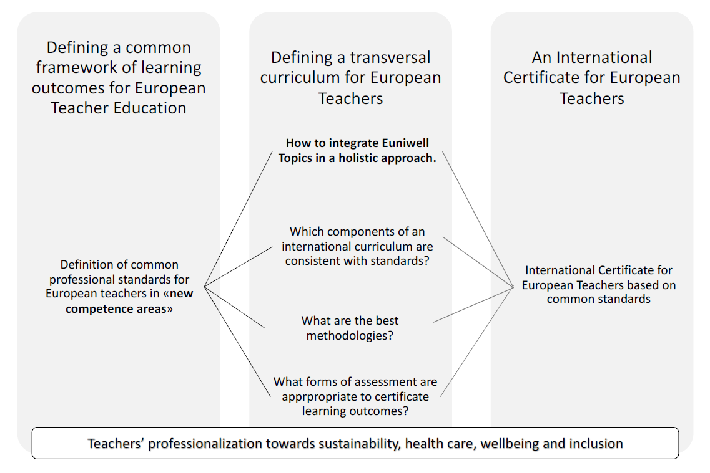 Teacher Education Logical Framework, Del Gobbo et al. (2023)[^2]

 

The new competence areas for teachers' professionalization were defined as:

1. Sustainability
2. Healthcare
3. Well-being
2. Inclusion

For each area, professional standards have been identified and broken down into sub-components and related professional behaviours expected of the teachers of the future.

Professional Standards for Inclusion
====

The idea of inclusion refers both to an ideological stance and an approach to designing education.

"When referring to the design of education, inclusion implies a classroom where the diversity of students is acknowledged in that all students are provided with a meaningful education (Florian, 2017[^3]; Popkewitz, 2004[^4]). An inclusive classroom contains a diverse mix of students and inclusion relates to social, spatial, and didactical aspects of education (Asp-Onsjö,2006)[^5].

* The teacher has knowledge of and confidently implements research-based inclusive education.
* The teacher is able to plan and adapt differentiated education that respects the different needs of students.
* The teacher promotes supportive education aimed at fostering independence, self-confidence, and critical thinking in learners."

(EUniWell,2022)[^6]

Examples of Professional Standards and Related Professional Behaviours (Inclusion)
---

<!-- data-type="none" -->
| Core Competence                          |                                      Professional Standards                                       |                                                                                                                          Sub-Components of Standards |                                                   Expected Professional Behaviour |
| :---------------------------------------- |:-------------------------------------------------------------------------------------------------| :---------------------------------------------------------------------------------------------------------------------------------------------------| :---------------------------------------------------------------------------------|
| Creating an inclusive learning environment. | Being able to plan and adapt differentiated education that respects the different needs of students. |                                                                          Being able to plan inclusively and accommodate the (special) needs of pupils.  | Assessing each student's abilities and challenges within the specific learning group. | 
| -                                        |                                                 .                                                 | Being able to adapt curriculum requirements to students' (special) needs and being able to create differentiated learning materials and environments. |Adapting curriculum requirements to students' (special) needs and creating differentiated learning environments.|
^Table 1. (EUniWell, 2022)[^6]^

[^1]: UNESCO, International Commission on the Futures of Education. (2021). Reimagining our futures together: a new social contract for education. UNESCO. https://doi.org/10.54675/asrb4722

[^2]: Del Gobbo, Daniela Frison, André Bresges, Donna J. Dawkins, Jan Springob, Juan Antonio Solis Becerra, Ibolya Túri, Magali Hersant, Giovanna. (2023). Sustainability, health care, well-being, and inclusion: toward new professional standards for the teachers of the future. Nuova Secondaria , 5, 146-154.

[^3]: Florian, L. (2017). Teacher education for the changing demographics of schooling: Inclusive education for each and every learner. In Teacher education for the changing demographics of schooling (pp. 9-20). Springer, Cham.

[^4]: Popkewitz, T. S. (2004). Educational standards: Mapping who we are and are to become. The Journal of the Learning Sciences, 13(2), 243-256.

[^5]: Asp-Onsjö, L. (2006). Åtgärdsprogram - dokument eller verktyg? En fallstudie i en kommun. https://gupea.ub.gu.se/handle/2077/16941

[^6]:EUniWell, University of Florence. (2022). Deliverable Report (D3.27) Definition of common professional standards for European teachers.

## UNESCO Global Education Report on Inclusion and Education

> "Education makes an essential contribution to building inclusive and democratic societies, where differences of opinion can be freely expressed and where the wide range of voices can be heard, in pursuit of social cohesion and in a celebration of diversity."
>
> -- Right Honourable Helen Clark, Chair of the GEM Report Advisory Board, Former Prime Minister of New Zealand. (2020)[^1]

Inclusion and Education
-------

Watch the Inclusion and Education: #AllmeansALL video presenting insights from the 2020 UNESCO Global Education Monitoring report.

This video provides an overview of how education that is not inclusive affects children and what can be done to promote change and to ensure that all children have access to an inclusive and equitable quality education.

!?[UNESCO 2020 Global Education Monitoring Report](https://www.youtube.com/watch?v=kEyjlqixq9c "Source: https://www.youtube.com/watch?v=kEyjlqixq9c")

~~**Click here to show the video transcript**~~

Intro:

Everyone is different. The 2020 Global Education monitoring report on inclusion and education believes that education is strongest when it embraces diversity. Learners should not have to adapt to the system; instead, education systems should adapt to their needs. When students do not feel welcome in school, they are less likely to learn. This is everyone's loss. But rich and poor countries too often educate some children apart. Children who have a disability, have been displaced, speak a different language, or are poor and disadvantaged.

Problems:

School design may favour some students over others, as do many laws and policies. Teachers are often ill-equipped to cater for students diverse needs. Children may not recognise the way they are portrayed in textbooks. Some may not see themselves there at all. They receive the message that they do not belong. Testing sometimes follows a narrow vision of education and consequently some students leave education earlier than they should. These are complex problems to solve, but a belief in the right to education is a belief in inclusion. Children have different learning speeds and needs. They need curricula that are flexible, creative and relevant. How we prepare teachers matters. They must be given the tools and training to achieve our vision for reform. The resources we know can help the marginalised. Educators, support staff and equipment should be shared so that everyone can benefit.Better data on those left behind will help us reach them. Disadvantages often accumulate. We can't address inclusion one group at a time.

Conclusion:

Redressing these disadvantages requires funds. These must be equitable and target individual specific needs. We must work together on these tasks across government ministries, from central to local authorities with civil society supporting governments and  schools opening doors to the community. Inclusion in education requires a change in mindset in society, so that education for all means education for everyone without an exception. Achieving this is everybody's business, including yours.

---

For more information download the full report on the [UNESCO 2020 Global Education Monitoring Report website](https://www.unesco.org/gem-report/en/inclusion)

---

[^1]: UNESCO. (2020). Global Education Monitoring Report 2020: Inclusion and education: All means all. Paris. UNESCO. https://doi.org/10.54676/jjnk6989

In the Next Chapter
---
We will outline the underlying social structures that influence the development, perception, and handling of inclusion and diversity.

## 1. Systems Theory Perspectives

To help you to gain a broader and deeper understanding of the central topics of diversity and inclusion and of wider social facts and processes, we will begin with a look at selected theories and models from the educational and social sciences. References to school theory are highlighted and specific examples of teacher professionalisation are explained.

> __Learning Goals__
>
> * You are able to describe the significance of inclusive education and its impact on society.
> * You are able to explain the application of systems theory to the school system (including multi-level and ecosystemic models).
> * You are able to describe how symbolic interactionism explains social behaviours related to inclusion.

### 1.1 Interrelations of Main Social Systems

Early sociologists assume certain universal functional requirements in societies and recognise a de facto differentiation of social systems (Parsons, 1968)[^1]. The sociological model below, "Social Subsystems" by Fend (2009)[^2] represents a structural-functionalist perspective.

It forms the basis of school theory and depicts three major systems of society in abstract terms. The decisive factors here are the interrelationships and the fact that school is located as an institution in the Eeducation system that dependsing on the politicsal and economic systems.

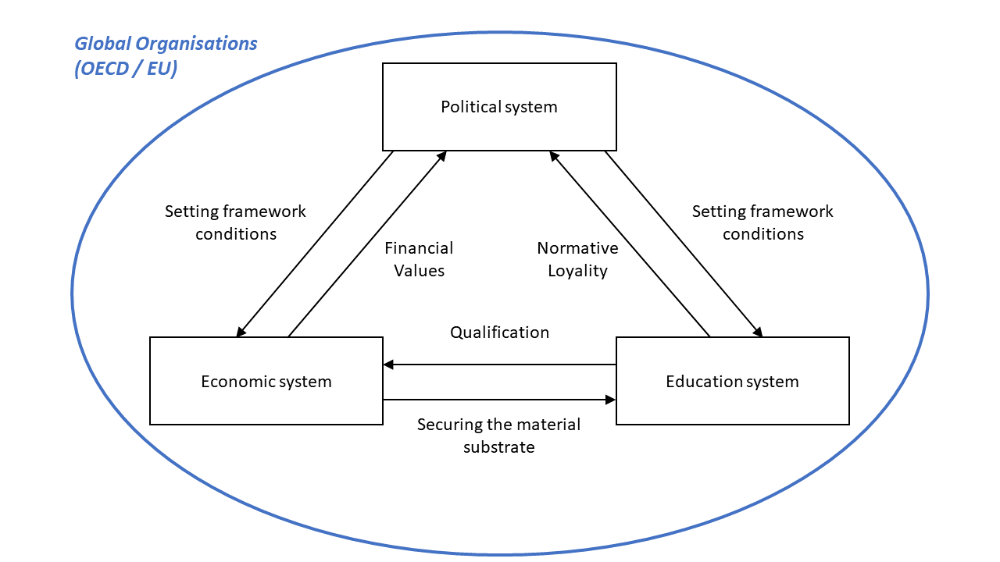 Global Organisations and Systems, own illustration based on Fend (2009) p.36 [^2]

 

The model shows that the socialisation order of a society can be characterised by the three subsystems of politics, economics and education.

* The __political system__ sets the framework conditions for the other two systems.

* The __economic system__ organises work and the production and distribution of goods.

* The __education system__ organises the production of qualifications and mental infrastructures.

Under the conditions of increasing global competition between economic centres, for example, the EU considered it necessary to invest in people in order to raise the level of education of the entire population. Education, understood as a labour market-related qualification, was given central importance. At the same time, educational institutions such as schools must ensure that individuals acquire the skills they need to participate in society. By acquiring these social skills, individuals should be able to strengthen democratic development and social cohesion.

Despite this orientation of the education system, not all individuals can participate equally. This leads to marginalisation and individual disadvantage, for example due to race and social background.

Social Movements
---
Initiated by successful anti-discriminatory social activists, political guidelines and recommendations were established (e.g. US Civil Rights Act 1964). In particular, education systems were called upon to engage in the establishment of inclusive development in the sense of progressive, sustainable modernisation.

Inclusion as a Special Phenomenon in Current Society
---

Let us imagine inclusion at the centre of this social systems model.

 Inclusion in the Center of Social Systems, own illustration based on Fend (2009) p.36[^2]

 

Political guidelines and recommendations direct all the other systems to engage with the establishment of inclusive development and to foster progressive, sustainable modernisation. With regard to the education system, schools as institutions have the tasks of __ensuring inclusion__ and __further developing inclusion__. Last but not least, inclusion is about the individual in society. In the education system, this concerns students, teachers, parents, and school management.

What You Will Find in the Next Section
---

We use Bronfenbrenner's socio-ecological model to illustrate the position of the individual within social structures.

[^1]: Ellis, D. P. (1968). SOCIOLOGICAL THEORY AND MODERN SOCIETY. By Talcott parsons. New York: The free press 1967. 564 pp. $12.50. Social Forces; a Scientific Medium of Social Study and Interpretation, 47(1), 90–91. https://doi.org/10.2307/2574723

[^2]:Fend, H. (2009). Neue Theorie der Schule. VS Verlag für Sozialwissenschaften. https://doi.org/10.1007/978-3-531-91788-7

### 1.2 Bronfenbrenner's Ecological Systems Theory

Uri Bronfenbrenner's Ecological Systems Theory posits that human development is influenced by the interactions between an individual and their environmental systems. (Bronfenbrenner, 1977)[^1] These systems are nested within each other with each layer representing a different level of influence.

Video: Bronfenbrenner's Ecological Systems 
---

!?

~~**Click here to show the video transcript**~~

In 1964, a young psychologist appeared before the US congress with a mission. It was a time when most people thought that the reason poor people stayed poor was a matter of biology and had nothing to do with the environment they grew up in. The psychologist, Uri Bronfenbrenner, wanted to change that and convince the world that to help those less fortunate, we also need to change their surroundings. But did he succeed?

Bronfenbrenner's Ecological System Theory conceives that a child is influenced by five ecological forces. First comes the microsystem of family and friends that affect the child directly. Second are the forces of the connections between the people around the child:parents with teachers and teachers with peers. Then there are links between social settings that do not directly involve the child, such as the father with his boss, the peers with their parents and the teacher with the principal. 

Next, is the overarching culture, religion and social norms that influences all others. And lastly, there is time - which changes everything over the course of one’s life. Children are born into a Microsystem that influences the child's experiences directly. Children from unfortunate backgrounds are more likely to experience problematic family structures -even if it’s simply for the fact that parenting is more difficult if you are poor. They also encounter more negative situations at school or bad influences through friends. Consequently, a child that grows up in a negative microsystem, will find it hard to succeed. 

The Mesosystem represents the interconnections between the elements that surround the child. For example the relationship between the father and the school teachers. If the father doesn’t get along with a teacher, the child might suffer. 

The EXOSYSTEM involves links between social settings that do not involve the child. For example, a child's experience at home can be influenced by their parent's experiences at work. If the mother loses her job, there might be more arguments with the father, resulting in changes in their interaction with the child.

The MACROSYSTEM describes the overarching culture that influences all other systems, such as a child’s geographic location and ethnicity. Intelligent people who happen to live in bad places are more likely to move to better ones.
But that also means that they are more likely to be strangers in a richer society. So regardless of the child’s biological potential or upbringing, on a macro level he or she may still be at a disadvantage.

The CHRONOSYSTEM,refers to changes in the child, and the environment over time. As the child grows up the parents may stop loving each other and divorce, which can be traumatic for an eight year old boy. Five years later, he may have come to terms with how things turned out. But when the boy turns 16, his mom’s new boyfriend moves into their tiny 
apartment, and things get difficult again.

Bronfenbrenner, who was influenced by Lev Vygotsky and Kurt Lewin, convinced the US congress that a child’s prospect is not genetically predestined, but is the result of the larger environment they happen to be placed in. Children who grow up in unfortunate social structures therefore need a form of support that not only reaches their families, but also elements of their community. Bronfenbrenner's theory helped form the Head Start program in 1965, a government program that has served more than 35 million poor children since. 

Decades later, Bronfenbrenner and Stephen Ceciproposed an extension of this theory, called the "bioecological model". This new model recognizes gene–environment interactions and acknowledges the role of heritability, but adds that genes themselve are under the influence of the environment. In other words, the process of heritability varies in a magnitude of potentials. How much a child can make of the potential they inherit, depends on the ecological environment.

Bronfenbrenner made a critical contribution to our realization that parent-child relationships do not exist in a social vacuum but are embedded in the larger structures, such as community, society, and culture. In order to develop well, he allegedly said, “every child needs at least one adult who is irrationally crazy about him or her.” 

Now it’s your turn, make five circles, draw yourself in the center and add a timeline at the bottom. Then add all the people, institutions and forces that affect your life. On the timeline below you can add some major events from the past and those you expect in the future. Can you tell how the 5 forces are shaping your life?

---

The Ecosystemic Development Model
---

The Ecosystemic Development Model according to Epp (2017)[^3] translated from German

 

Microsystem
-----
"A microsystem is the complex of relations between the developing person and environment in an immediate setting containing that person (e.g., home, school, workplace, etc.). A setting is defined as a place with particular physical features in which the participants engage in particular activities in particular roles (e.g., daughter, parent, teacher, employee, etc.) for particular  periods of time. The factors of place, time, physical features, activity, participant, and role constitute the elements of a setting." (Bronfenbrenner, 1977, p. 514)[^1] 

Mesosystem
-----
"A mesosystem comprises the interrelations among major settings containing the developing person at a particular point in his or her life. Thus, for an American 12-year-old, the mesosystem typically encompasses interactions among family, school, and peer group; for some children, it might also include church, camp, or workplace, although the last would be less common in the United States than in some other societies. In sum, stated succinctly, a mesosystem is a system of microsystems." (Bronfenbrenner, 1977, p. 515)[^1]

Exosystem
-----
"An exosystem is an extension of the mesosystem embracing other specific social structures, both formal and informal, that do not themselves contain the developing person but impinge upon or encompass the immediate settings in which that person is found, and thereby influence, delimit, or even determine what goes on there. These structures include the major institutions of the society, both deliberately structured and spontaneously evolving, as they operate at a concrete local level. They encompass, among other structures, the world of work, the neighborhood, the mass media, agencies of government (local, state, and national), the distribution of goods and services, communication and transportation facilities, and informal social networks.“ (Bronfenbrenner, 1977, p. 515)[^1]

Macrosystem
---
"A macrosystem refers to the overarching institutional patterns of the culture or subculture, such as the economic, social, educational, legal, and political systems, of which micro-, meso-, and exo-systems are the concrete manifestations. Macrosystems are conceived and examined not only in structural terms but as carriers of information and ideology that, both explicitly and implicitly, endow meaning and motivation to particular agencies, social networks, roles, activities, and their interrelations." (Bronfenbrenner, 1977, p. 515)[^1]

Chronosystem
---
As you have seen in the above video, the Chronosystem includes all of the experiences that a person has endured throughout their lifetime (e.g. transitions, and historical events). By understanding these layers of influence, educators can be sensitised to create more inclusive and diverse educational environments.

By understanding these layers of influence, educators can be sensitised to create more inclusive and diverse educational environments.

> @admonition(warning, Task: )
> 
> Now it´s Your Turn
>
> Draw Bronfenbrenner's ecosystem circles and place yourself at their centre. Reflect on the following questions as you fill in the circles.
>
> * Which factors influence your individual microsystem?
> * Which interrelationships does your mesosystem comprise?
> * Name the events, formal / informal social structures which influence your current life.
> * Name the political, legal, economic or educational patterns and ideologies wich influence your current life.

What You Will Find in the Next Section
-------
Given the interactions and influence of individual thought structures and inclusion in this complex framework, we will consider interaction between two individuals at different levels. The theory of symbolic interactionism will help us to understand how new meanings and thought structures can emerge from interactions.

[^1]:Bronfenbrenner, U. (1977). Toward an experimental ecology of human development. The American Psychologist, 32(7), 513–531. https://doi.org/10.1037/0003-066x.32.7.513

[^2]: Epp, A. (2017). Bronfenbrenner’s Ecological Systems Theory as a Sensitization and Examination Pattern for Empirical Analyses. Forum Qualitative Sozialforschung Forum: Qualitative Social Research, 19(1). https://doi.org/10.17169/fqs-19.1.2725

### 1.3 Symbolic Interactionism Theory

Similar to institutions, social roles emerge from a particular social dynamic. Role adoption does not only occur as trained behaviour, but rather roles are continuously and meaningfully imparted in socialisation processes. According to Mead's Symbolic Interactionism Theory (Mead, 1934)[^1], individual identities develop from self-reflection, reflection on others and interaction with others.

I, Me and Self.
---

Mead distinguishes three concepts of the individual in his symbolic interactionism theory: I, Me and Self.

Individuum: I, Me & Self. Own illustration.

 

* The __"I"__ is the psychological component. This is where people's creative and impulsive emotions and actions occur.

* The __"Me"__ is the social component and the objective part of a person. It is shaped by the respective society and comes into conflict with external expectations and other people's attitudes.

* The __"Self"__ arises from the interaction between "Me" and "I" and develops from processes of experience and development. The Self is not a fixed construct and continues to develop in the process. The Self reflects a person's self-perception and self-image.

Based on the descriptions and theoretical considerations above, we can deduce that inclusive attitudes and the sense of belonging they create are also ongoing social-systemic and individual developments. In social interactions, we can actively shape inclusion and reflect on our own inclusive attitude.

The following model, based on the idea of symbolic interactionism theory (Mead, 1934[^1]; see also Joas, 1989[^2]; Helle, 2001[^3]) shows how inclusion can arise from social interactions and result in an individual attitude.

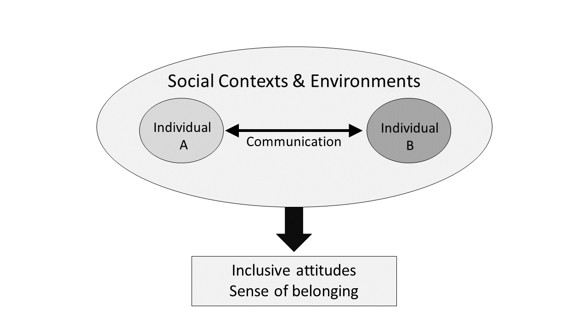Individuals´ interactions. Own illustration.

 

What You Will Find in the Next Section
---------
You can test your acquired knowledge below.

[^1]: Mead, G. H. (1934). Mind, self and society from the standpoint of a social behaviorist. University of Chicago Press. https://www.ssoar.info/ssoar/handle/document/50777

[^2]: Joas, H. (1989). Intersubjektivität – Die Entwicklung des Werkes von G. H. Mead. Berlin: Suhrkamp. 

[^3]: Helle, H. J. (2001). Theorie der symbolischen Interaktion: ein Beitrag zum verstehenden Ansatz in Soziologie und Sozialpsychologie (3rd ed.). Düsseldorf: Westdeutscher. 

###	1.4 Summary Quiz

<iframe src="https://euniwell.de.cool/wp-admin/admin-ajax.php?action=h5p_embed&id=29" width="958" height="688" frameborder="0" allowfullscreen="allowfullscreen" title="Bronfenbrenners Ecological Model (Drag&amp;Drop)"></iframe>

<iframe src="https://euniwell.de.cool/wp-admin/admin-ajax.php?action=h5p_embed&id=30" width="958" height="687" frameborder="0" allowfullscreen="allowfullscreen" title="Fends Social Systems Interaction (Drag &amp; Drop)"></iframe>

## 2. Discrimination, Diversity and Inclusion

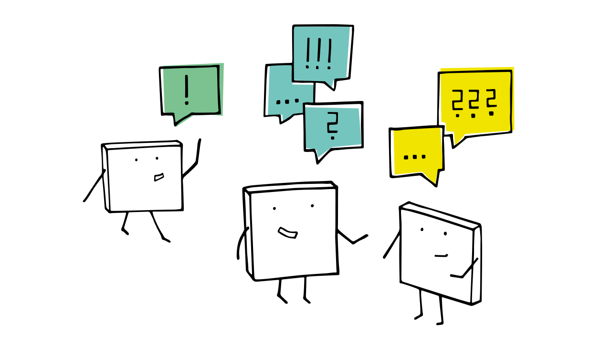

This chapter looks at the definitions of discrimination, diversity and inclusion.

We take a close look at conceptual changes and differences between exclusion, separation, integration, and inclusion in education from a social-historical perspective. We also delve into the term discrimination - as the opposite of inclusion - because of its relevance for recognising diversity.

> __Learning Goals__
>
> * You are able to provide basic definitions of diversity and inclusion and to delineate related concepts such as exclusion, separation, and integration.
> * You are able to describe forms of discrimination.

### 2.1 Definitions

Discrimination
---
The ethymological origin of the term ‘discrimination’ is the Latin word discriminatus, past participle of discriminare 'to divide, separate, from discrimen" (Harper, n.d.).[^1] 

> __Definition of Discrimination__
>
> "treating a person or particular group of people differently, especially in a worse way from the way in which you treat other people, because of their race, gender, sexuality, etc." (Cambridge University Press, n.d.)[^2]

Discrimination occurs in many areas of everyday life, including educational setting. For example, ethnic minority students disengage from school because they experience discrimination based on their ethnicity (Civitillo et al., 2024).[^3]

Diversity 
---

The ethymological origin of the term ‘diversity’ is the Latin word diversitatem
(nominative diversitas) "contrariety, contradiction, disagreement;" also, as a secondary sense, "difference, diversity," from diversus "turned different ways"(Harper, n.d.).[^4] 

> __Definition of Diversity__
>
> Diversity is as condition that reflects the variety and the differences between individuals in a society (Walgenbach, 2021).[^5]
> 
> The variety of differences can be reflected on three levels: 1. social, 2. biological, 3. psychological-emotional (Bührmann, 2018).[^6]

Inclusion
---

The ethymological origin of the term inclusion’ is the Latin word includere "to shut in, enclose, imprison, insert"(Harper, n.d.).[^7] 

> __Definition of Inclusion__
>
> Stichweh (2007)[^8] distinguishes between three contexts in which definitions of inclusion originated:
>
> __1. Sociological systems theory__ - this approach identifies __inclusion and exclusion__ by analysing the forms in which people participate in and are considered by social systems. 
>
> __2. French social theory__, which since Durkheim has seen the concepts of __inclusion and solidarity__ in society as almost identical. In this context, the degree of inclusion or exclusion which is identified as signals that society has succeeded or failed.
>
> __3. British welfare state theory__, with its use of the paradigm of citizenship to conceptualise the communicative consideration of people in social systems as membership.

What You Will Find in the Next Section
----

We will present the field of terms between exclusion and inclusion.

[^1]: Harper, D. (n.d.). Etymology of discriminate. Online Etymology Dictionary. Retrieved November 24, 2024, from https://www.etymonline.com/word/discriminate

[^2]: Cambridge University Press. (n.d.). Meaning of discrimination in English. Cambridge Dictionary. Retrieved November 24, 2024, from https://dictionary.cambridge.org/dictionary/english/discrimination

[^3]: Civitillo, S., Jugert, P., Yip, T., Lui, P. P., & Titzmann, P. F. (2024). A daily diary study on associations between school-based ethnic discrimination and school engagement. Social Psychology of Education: An International Journal. https://doi.org/10.1007/s11218-024-09919-x

[^4]: Harper, D. (n.d.). Etymology of discriminate. Online Etymology Dictionary. Retrieved November 24, 2024, from https://www.etymonline.com/word/diversity 

[^5]: Walgenbach, K. (2021). Erziehungswissenschaftliche Perspektiven auf Vielfalt, Heterogenität, Diversity / Diversität, Intersektionalität. Verlag Julius Klinkhardt. https://doi.org/10.25656/01:22247

[^6]: Bührmann, A. D. (2018). Diversität. socialnet Lexikon [last access: 26.09.2024]. https://www.socialnet.de/lexikon/6324

[^7]: Harper, D. (n.d.). Etymology of discriminate. Online Etymology Dictionary. Retrieved November 24, 2024, from https://www.etymonline.com/word/inclusion

[^8]: Stichweh, R. (2007). Inklusion und Exklusion in der Weltgesellschaft – Am Beispiel der Schule und des Erziehungssystems. In J. Aderhold & O. Kranz (Eds.), Intention und Funktion (pp. 113-120). VS. https://doi.org/10.1007/978-3-531-90627-0_5

### 2.2 Exclusion, Segregation, Integration and Inclusion in Education

In the following we present the "model of quality levels of disability policy and disability education" according to Wocken (2009).[^1]

"The model of quality levels should not be interpreted as historical development phases or even as logical sequences. Instead, the quality levels refer to a value hierarchy of increasingly higher-value human rights and forms of recognition." (Grosche, 2015)[^2]

Model of Quality Levels of Disability Policy and Disability Education
---

| Level and Description  | Illustration [^4] | 
| :------- | :------: | 
| Level 0 - __Extinction__    "Extinction occurred, for example, during the Nazi era in Germany, when people with disabilities were systematically murdered." (Grosche, 2015)[^1]     |      | 
| Level 1 - __Exclusion__    "Exclusion occurs when students are directly or indirectly prevented from or denied access to education in any form." (UN-CRPD, 2016)[^3]     |      | 
| Level 2 - __Segregation__    "Segregation occurs when the education of students with disabilities is provided in separate environments designed or used to respond to a particular or various impairments, in isolation from students without disabilities." (UN-CRPD, 2016)[^3]     |      | 
| Level 3 - __Integration__    "Integration is a process of placing persons with disabilities in existingmainstream educational institutions, as long as the former can adjust to the standardized requirements of such institutions." (UN-CRPD, 2016)[^3]     |   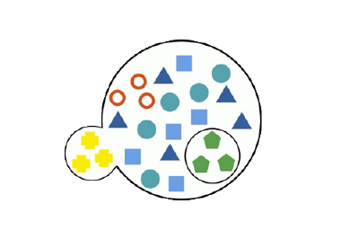   | 
| Level 4 - __Inclusion__    "IInclusion involves a process of systemic reform embodying changes and modifications in content, teaching methods, approaches, structures and strategies in education to overcome barriers with a vision serving to provide all students of the relevant age range with an equitable and participatory learning experience and environment that best corresponds to their requirements and preferences." (UN-CRPD, 2016)[^3]     |   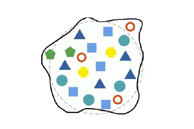   | 

What You Will Find in the Next Section
--------
We will invite you to reflect on discrimination.

[^1]: Wocken, H. (2009). Inklusion & Integration. Ein Versuch, die Integration vor der Abwertung und die Inklusion vor Träumereien zu bewahren. In Integration und Inklusion auf dem Wege ins Gemeinwesen (pp. 204–234). A.-D. Stein, I. Niediek, & S. Krach. https://inklusion20.de/material/inklusion/Inklusion%20vs%20Integration_Wocken.pdf

[^2]: Grosche, M. (2015). Was ist Inklusion? Ein Diskussions- und Positionsartikel zur Defi nition von Inklusion aus Sicht der empirischen Bildungsforschung. In P. Kuhl, P. Stanat, B. Lütje-Klose, C. Gresch, H. A. Pant, & M. Prenzel (Eds.), Inklusion von Schülerinnen und Schülern mit sonderpädagogischem Förderbedarf in Schulleistungserhebungen (pp. 17–39). Springer Fachmedien Wiesbaden. https://doi.org/10.1007/978-3-658-06604-8

[^3]: UN-CRPD (Committee on the Rights of Persons with Disabilities). (2016) General comment No. 4 on the right to inclusive education. Convention on the Rights of Persons with Disabilities. https://documents.un.org/doc/undoc/gen/g16/263/00/pdf/g1626300.pdf 

[^4]: Original illustration by Robert Ähnelt (CC-BY-SA 3.0 DE) modified by Michael Kowalczyk (CC-BY-SA 4.0 DE)

### 2.3 Exercise: Thinking About Inclusion from a Student Perspective
-------------------

Inclusive education is different from "integration", which is identified with the movement of those who advocate for the education of students with disabilities in mainstream schools. It also differs from "mainstreaming", in which students with disabilities are taught in special education classes but "participate" in mainstream classes to take part in educational and social activities with their peers from mainstream schools. Unlike integrated pupils or pupils in mainstream schools, pupils who receive inclusive education services are members of the mainstream school community (Hunt & McDonnell, 2007, p. 270)[^1].

Interactive Reflection on Inclusive Settings in the Classroom
---

> @admonition(warning, Task: )
>
> Watch the following video "What is Inclusion" to gain an understanding of the differences between integration, perceived inclusion, and true inclusion.
> 
> Pay attention to the following points:
>
> * How homogeneously or heterogeneously is the class community portrayed?
> * Observe who is located where in the classroom and where people move to.
> * Who interacts with whom, and how?
> * What impressions, feelings, and wishes does the narrator describe?
>
> After the video use drag&drop interaction to sort the observations into the appropriate fields.

!?[What Is Inclusion?](https://www.youtube.com/watch?v=3VMz06iVzqs&t=32s)

~~**Click here to show the video transcript**~~

Integration

I don't understand why I'm at the back of the class. I wish I was like everyone else. I want to do what they are doing. But here I am doing this a same old number activity watching as my classmates learn something else. Don't they know that they're setting me up to fail? Don't they know they hold my future in their hands? I want to work in my class, learn what they are learning and do the activities they do. But here I am stuck at the back, limited by low expectations. Having a one-on-one teacher aide just teaches me to rely on them and means I get less attention from the teacher. I'm not included in the classroom, I am in the same room but segregated from my peers, sat to the side or back working on different things and missing out. I want to be free to learn with my peers reach my full potential and be seen to be like everyone else. I need something to change.

Perceived inclusion

You may be wondering what was wrong with this picture? I'm in the classroom with my peers, sitting on my seat, learning the same things as everyone else. You may think this is inclusion, but it's not. I am stifled, limited and held back from reaching my full potential. Though I love my teacher aid, I don't get to think for myself. In fact a lot of the time my teacher aid does it for me, even whispering the answer in my ear when I already know it. The more she is with me the more I realized that there is no point in me thinking for myself because she would give me the answer anyway. I'm sure there are other kids who also need to her help, does she need to be with just me? Can´t she help others? Surely If I need help I can put my hand up and ask my teacher like my friends do. My friends and classmates want to help me but by having someone right next to me they can't. I need to learn from my peers, be able to do group work and be challenged. I want to be allowed to fail or succeed and learn from it. I need something to change. 

Inclusion

Can you find me in the crowd? Inclusion is more than just a word. It is a culture, a mindset and an expectation that everyone can and will learn and succeed along their age-appropriate peers. I know it can be challenging to include me in the learning as sometimes I might require extra resources and information but giving me space to learn from my teacher and peers is the best way to challenge me and allow me to grow. I want to learn the same things as my classmates and I want teachers to have the same expectations of me as my friends. Mmy learning may need to be modified by I still want the opportunity to show what I can do, not focus on what I can't. Treat me the same as any other student and watch me flourish. I will rise to the challenge of expectations you set for me. Are you ready to really include me?

---

Drag and Drop Your Observations Into the Appropriate Fields.
-------

<iframe src="https://euniwell.de.cool/wp-admin/admin-ajax.php?action=h5p_embed&id=32" width="958" height="688" frameborder="0" allowfullscreen="allowfullscreen" title="Integration, percieved inclusion &amp; inclusion (Drag &amp; Drop)"></iframe>

[^1]: Hunt, P., & McDonnall, J. (2007). Inclusive education. In van der Gaag, R.J. S. L. Odom, R. H. Horner, M. E. Snell, & J. Blacher (Eds.) (2007). Handbook of developmental disabilities. (pp. 269-291) New York/Londen: Guilford Press. https://doi.org/10.1007/BF03089708

## 3. Inclusion in Global Legal Foundations

Inclusion is a concept that has evolved over time and is fundamentally anchored in human rights. Its anchoring in the UN Convention on the Rights of Persons with Disabilities, which reflects an understanding of disability based on human rights, has contributed to its general dissemination. Subsequently, the concept of inclusion became less strictly coupled to disability and established as a more general principle for dealing with diversity in society. Perceptions of an increasing divide over gender issues, generational conflicts, socio-economic divergence, and the challenges of cultural and religious diversity in the face of increased migration also came into focus.

> __Learning Goal__
>
> * You are able to describe the significance of international treaties and their implications for inclusion in education.

###	3.1 Treaties as Historical Milestones

International treaties and frameworks play a crucial role in advancing global standards for human rights and for inclusion and diversity in education.

Among the most influential are the __1948 Universal Declaration of Human Rights (UDHR)__, the __1966 International Covenant on Civil and Political Rights (ICCPR)__, and the __International Covenant on Economic, Social and Cultural Rights (ICESCR)__. Together they formed the bedrock of international human rights law, also emphasizing the universal right to education.

The __1989 Convention on the Rights of the Child (CRC)__ further underscored the specific needs and rights of children, advocating for their right to receive education in a manner that respects their inherent dignity and promotes their overall development. Complementing these frameworks, the __Salamanca Statement and Framework for Action on Special Needs Education__ adopted in 1994 called for inclusive education systems that accommodate all children, regardless of their physical, intellectual, social, emotional, linguistic, or other characteristics.

In addition, the __2006 Convention on the Rights of Persons with Disabilities (CRPD)__ strengthened commitment to inclusion by emphasising the right of persons with disabilities to access quality education without discrimination and on an equal basis with others. This convention has been instrumental in shifting perspectives towards a more inclusive and equitable approach to education.

The __Sustainable Development Goals for 2030 (SDGs)__ established in 2015, particularly Goal 4.5, which aims to eliminate gender disparities in education and ensure equal access to all levels of education for the vulnerable, provided a comprehensive roadmap for global education development.

Together, these international legal instruments and goals compel governments and educational institutions to recognise and address the diverse needs of all learners.

Treaties Timeline: International Human Rights and Education For All
-----------------------

<iframe src="https://euniwell.de.cool/wp-admin/admin-ajax.php?action=h5p_embed&id=15" width="95%" height="625" frameborder="0" allowfullscreen="allowfullscreen" title="EN - Timeline - Legal Foundations for Diversity &amp; Inclusion in Education"></iframe>

### 3.2 Sustainable Developement Goals 2030 (SDGs)

The [Sustainable Development Goals (SDGs)](https://sdgs.un.org/goals) were established in 2015 during the United Nations Sustainable Development Summit as a universal call to action to end poverty, protect the planet, and ensure prosperity for all by 2030. 

They were created to address the global challenges facing humanity, including inequality, climate change, and the achievement of peace and justice.

SDG 4 - Quality Education
---

__Sustainable Development Goal (SDG) 4__ on education calls for inclusive and equitable quality education and lifelong learning opportunities for all by 2030. It emphasises inclusion and equity as foundations for quality education and learning.

SDG 4 also calls for building and upgrading education facilities that are child-, disability-, and gender-sensitive and for
providing safe, non-violent, inclusive and effective learning environments for all.

To achieve this ambitious goal, countries should ensure inclusion and equity in and through education system and programmes. This includes taking steps to prevent and address all forms of exclusion and marginalisation, disparity, vulnerability and inequality in educational access, participation, and completion as well as in learning processes and outcomes. It also requires understanding learners' diversities as opportunities in order to enhance and democratise learning for all students. (UNESCO, 2017)[^1]

<iframe src="https://euniwell.de.cool/wp-admin/admin-ajax.php?action=h5p_embed&id=19" width="950" height="702" frameborder="0" allowfullscreen="allowfullscreen" title="17 Sustainable Developement Goals"></iframe>

---

[^1]: UNESCO. Assistant Director-General for Education, 2010-2018 (Qian Tang), & UNESCO. (2017). A guide for ensuring inclusion and equity in education. UNESCO. https://doi.org/10.54675/mhhz2237

###	3.3 Summary Quiz

<iframe src="https://euniwell.de.cool/wp-admin/admin-ajax.php?action=h5p_embed&id=37" width="958" height="544" frameborder="0" allowfullscreen="allowfullscreen" title="International treaties (Question set)"></iframe>

## 4. Inclusive School Structures and Practices

It becomes clear that inclusion is a sense of belonging, feeling respected and valued and being seen for who we are as individuals. However, it takes a certain level of commitment and supportive energy from school leaders and colleagues, as well as other educators, for us as individuals and as a collective to be inclusive in the school system (see Miller & Katz, 2002)[^1].

> “Inclusive education is meaningful only when embedded in understandings about 
> community and communality, only when seen as both reflective of, and creative of
> inclusion in society.”
>
> -- Thomas (2013)[^2]

The broad understanding of inclusive education at the heart of this OER takes this quotation as its departure point and encompasses changes and modifications of structures, approaches, strategies, teaching methods, and learning content.

The intention is that the social systems involved in school education – be it at close range like schools and families or more distantly like school principals, university lecturers, and politicians – should overcome barriers and discrimination with a shared vision for providing all students with equitable and participatory education (cf. also Köpfer et al., 2021)[^2].

> __Learning Goals__
>
> * You are able to specify what inclusive education means.
> * You are able to explain how inclusive education could be implemented in schools at different levels (i.e. education system, single school, lesson).

[^1]: Frederick, A., & Katz, J. H. (2002). The Inclusion Breakthrough: Unleashing the Real Power of Diversity Miller. Berrett-Koehler Punlishers, Inc.

[^2]: Thomas, G. (2013). A review of thinking and research about inclusive education policy, with suggestions for a new kind of inclusive thinking. British Educational Research Journal, 39(3), 473–490, p.485. https://doi.org/10.1080/01411926.2011.652070

[^3]: Köpfer, A., Powell, J. J. W., & Zahnd, R. (2021). Handbuch Inklusion international / International handbook of inclusive education (A. Köpfer, J. J. W. Powell, & R. Zahnd, Eds.). Verlag Barbara Budrich. https://library.oapen.org/handle/20.500.12657/46311

### 4.1 Inclusive Education – A Broad Term and a Shared Endeavour

"An important element of inclusive education involves ensuring that all teachers are prepared to teach all students. Inclusion cannot be realized unless teachers are empowered agents of change, with vlues, knowledge and attitudes that permit every student to succeed. Despite their differences in teacher standards and qualifications, education systems are increasingly moving away from identifying problems with learners and towards identifying barriers to learning. To complete this shift, education systems must design teacher education and professional learning opportunities that dispel entrenched views that some students are deficient, unable to learn or incapable." (UNESCO, 2020)[^1] 

Core values and competence areas of inclusive teaching
---

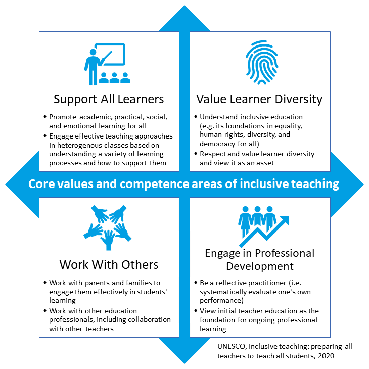Core Values and Competence Areas of Inclusive Teaching, UNESCO (2020)[^1]

------

~~**Click here to show the "Core Values and Competence Areas of Inclusive Teaching" text table**~~

<!-- data-type="none" -->
| Core values and competence areas of inclusive teaching | Core values / Competence areas                                                                                          | Core values / Competence areas                                                                                                                          ||
| ------------------------------------------------------ | --------------------------------------------------------------------------------------------------------------------- | ----------------------------------------------------------------------------------------------------------------------------------------------------- |
| __Support All Learners__                               | Promote academic, practical, social, and emotional learning for all                                                    | Engage effective teaching approaches in heterogenous classes based on understanding a variety of learning processes and how to support them |
| __Work With Others__                                       | Work with parents and families to engage them effectively in students' learning                                                 | Work with other education professionals, including collaboration with other teachers                                                                  |
| __Value Learner Diversity__                                | Understand inclusive education (e.g. its foundations in equality, human rights, diversity, and democracy for all) | Respect and value learner diversity and view it as an asset asset                                                                                                 |
| __Engage in Professional Development__                     | Be a reflective practitioner (i.e. systematically evaluate one's own performance)                                      | View initial teacher education as the foundation for ongoing professional learning                                                                    |

(UNESCO, 2020)[^1]

---

The values, core competences, values, and professional standards listed here reflect current developments and recommendations for action in the area of inclusion and diversity.

What You Will Find in the Next Section
----

We will focus on the Response to Intervention approach as a mode of targeted prevention that is implemented in successful educational nations.

[^1]: UNESCO Global Education Monitoring Report Team, International Task Force on Teachers for Education. (2020). Inclusive teaching: preparing all teachers to teach all students. https://unesdoc.unesco.org/ark:/48223/pf0000374447 

### 4.2 The "Response to Intervention" Approach

Asking how successful educational nations deal with students who do not reach minimum standards in maths or language leads to the "Response to Intervention" (RTI) approach that "is a highly effective approach to supporting at-risk pupils and getting positive learning outcomes" (Hattie, 2018)[^1].

The Main Objective of RTI
---

The main objective of RTI is not to identify students as candidates for special education but rather to help all students achieve at a proficient level and ultimately make adequate yearly progress.

This means that the aim is not to categorise children as needing special support or not being in that category but about knowing exactly who is "not yet able" or not yet making enough progress towards achieving competences but can achieve them with targeted support and encouragement. Ongoing diagnostics are necessary for this. (Osberg, 2010)[^2].

Three Tiers
---

The RTI approach is often visualised as a pyramid and a model of three levels or tiers.

RTI Model. Pretti-Frontczak et al., 2014, p. 110[^3]

 

* __Tier 1:__ The lowest level involves regular teaching and responding adaptively to different learning requirements. All learners benefit from this. But some learners need more.

* __Tier 2:__ Children whose diagnostics indicate that certain competences have not yet been achieved receive focused interventions in a short-term, curriculum-based small intensive group and/or individual interventions at the tier 2 level, in order to catch up with the class. In many schools, this affects between 15 and 20 per cent of all students, but it can be relevant for a higher proportion of students in some schools.

* __Tier 3:__ At the third level, "special interventions" are provided for learners for whom the focused intervention was not sufficient. These interventions are designed for longer timespans, individualised, and based on in-depth diagnostics. They are often relevant for around five per cent of learners and they ensure that this group is addressed with responsible and professional pedagogical action (University of Rostock 2024)[^3]

Video: Response to Intervention: A Tiered Approach to Instructing All Students
-------
Let us watch the following video to find out more about the RTI approach.

!?

__Click here to show the video transcript__

Here we'll look at a three-tiered model often depicted as a triangle as one example of how a tiered framework can be used as a schoolwide strategy for instructing all students. 

All students will participate in tier one instruction. At this level, they'll receive effective differentiated instruction provided by the general classroom teacher as part of an evidence-based core curriculum. The evidence-based instruction offered at this level can be expected to meet the learning needs of 80 to 85% of all students. For students who don't respond adequately to Tier 1 instruction, more intensive interventions come into play.

Tier 2 interventions build upon the differentiated instruction provided at tier one by offering students more systematic instruction and intervention strategically designed to help them catch up in areas of difficulty. These interventions are usually delivered to a small group of students within the general classroom either by the classroom teacher or by another team member supporting the teacher who has also been trained to deliver the interventions. Tier 2 intervention will be offered to the 15% of students for whom Tier 1 instruction was not sufficiently intensive to meet their specific learning needs. But here is a critical point: students who receive targeted tier 2 interventions continue to participate in general tier one instruction. Tier two interventions do not replace the core curriculum, they supplement it. 

For example Dennis has been selected to receive tier 2 interventions. Based on the results of recent reading fluency data, he'll continue to participate in the 90 minutes of core reading instruction that is provided to all students in tier one each day, but in addition he'll spend another 30 minutes per day receiving targeted reading instruction at tier 2. Under RTI, his opportunities for learning and for catching up to his classmates will have been extended. 

We've saved the most intensive interventions available for the small percentage of students who still lag significantly behind their peers in making academic gains. Tier three interventions supplement the previous tiers by providing the most intensive evidence-based interventions to delivered to individual students or in very small groups. Again the intensity of instruction at this level increases, the size of student groups is reduced, and their opportunities for direct instruction extended. Interventions in tier three may be delivered by an intervention specialist or even a special education teacher, but again, these interventions supplement the instruction provided at tier one, not replace it, and students do not have to be identified as disabled in order to receive these interventions. Only about 5% of all students will require these intensive tier 3 interventions. Of these students, only a portion may go on to require special ed services.

 

When looking at this approach, it quickly becomes clear that educational policies and structures as well as competences of the school principals as mangers are crucial. RTI needs cooperation between educational actors (school principals, teachers, other professions, also parents) and in fact, this is a key prerequisite for quality education and professionalisation. 

What You Will Find in the Next Section
-----
In the next section, we will look at different types of cooperation.

[^1]: Waack, S. (n.d.). Hattie effect size list - 256 Influences Related To Achievement. VISIBLE LEARNING. Retrieved October 7, 2024, from https://visible-learning.org/hattie-ranking-influences-effect-sizes-learning-achievement/

[^2]: Riccomini, P., & Witzel, B. (2010). Response to Intervention in Math. Corwin Press. https://doi.org/10.4135/9781452219356

[^3]: Universität Rostock. (n.d.). The Response-to-Intervention Approach. Universität Rostock. Retrieved October 7, 2024, from https://www.rim.uni-rostock.de/en/response-to-intervention-approach/the-response-to-intervention-approach/

### 4.3 Cooperation und Multi-Professionality

Types of Cooperation
------

Based on Lütje-Klose et al.(2024)[^1] a distinction can be made between:

* __Multi-professional cooperation__ (i.e. between different professional groups like teachers, special needs teachers, and school social workers in multi-perspective and case-related counselling, diagnostics, and support planning),

* __Intra-professional cooperation__ (i.e. within a professional group like subject teachers), and

* __Inter-professional cooperation__ (i.e. between two professional groups like classroom teachers and special needs teachers who may work together with a class).

All of these types of cooperation require relationships characterised by partnership and conscious __sharing of goals, knowledge, resources, tasks, and responsibilities__. Such relationships depend on trust and respect, which need to be cultivated. Team development also requires time and commitment (Friend & Cook, 2010)[^2].

Multi-Professional Teams
-----

International research has clarified beyond doubt that multi-professional teams and successful cooperation between the different educational actors are particularly crucial for inclusive education and giving individual support to the members of a diverse student body (Köpfer et al., 2021)[^3]. 

The following illustration highlights the main features and conditions of successful multi-professional teams:

 Multiprofessional Teams. Own illustration based on Widmer-Wolf (2018)[^4]

 

General schools can establish different kinds of cooperation and adopt changes to their overall structure so that inclusion becomes part of the school culture.

The role of school leaders is crucial; they manage schools but also social networking.
Intra-professional cooperation could be seen as an easier challenge because the actors have the same professional background, understand each other's expertise, and can switch to understanding situations each other's perspectives more readily.

Inter-professional cooperation is a vital structure for inclusive lessons in general schools.

A Model of Teachers' Perspectives on Co-Teaching
---
Let us have a look at what teachers need to be successful in inclusive classrooms.
The illustration below is a model of teachers' perspectives on the conditions for successful co-teaching by Jurkowski, S., Ulrich, M., & Müller, B. (2023)[^5].

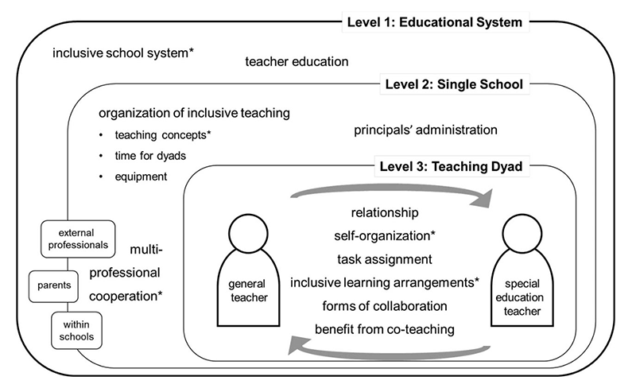 "3 Levels of Co-Teaching, Jurkowski, S., Ulrich, M., & Müller, B. (2023)[^5]

 

The categories describe the conditions for successful co-teaching in inclusive classes at the levels of the __education system, the single school, and the teaching dyad__.

> __Level 1 - Educational System__ 
> 
> We identified two categories at the level of the education system: __“teacher education”__ and __“inclusive school system”__.
>
> The __"teacher education"__ category includes aspects of professionalisation in the field of inclusive education (i.e. study curricula, pre-service and in-service teacher training). The special education teachers interviewed reported that they lacked the methodological knowledge that they would need to teach large groups. In contrast, the general teachers reported a need for knowledge about their students' special needs so they can provide sufficient assistance to those students when the special education teacher is not present.
>
> The __"inclusive school system"__ category reflected the teachers' ideas about the implementation of inclusion and educational opportunities for children with special needs. It became clear that the teachers desire the development of a fully inclusive school system. However, some teachers were not convinced that high-achievers would benefit.

> __Level 2 - The Single School__ 
> 
> The three main categories at this level relate to structural and organisational conditions as well as to attitudes towards co-teaching and collaboration between co-teachers in inclusive classes: __"organisation of inclusive teaching"__ (time for coordinating teaching dyads, equipment, and the planning of teaching), __"multi-professional cooperation"__ (cooperation within a school, with external professionals, and with parents and families), and __"principals' administration"__ (principals' responsibility to provide co-teachers with guidelines as well as their attitudes towards inclusive schooling).

> __Level 3 - The Teaching Dyad__ 
>
> The level of the co-teacher contains six categories relating to social-emotional and role-related aspects: __"relationship"__ (e.g. personal compatibility), __"task assignment"__ (e.g. professional role-taking), __"forms of collaboration"__ (e.g. shared reflection on a lesson and constructive planning), __"individual "benefits from co-teaching"__ (reduced stress and pressure, continued professional learning); __"self-organisation"__ (time windows for coordination), and __"inclusive learning arrangements"__ (adapted on a class-by-class basis).

Overall, this chapter has shown what adjustments the school system is and must be capable of making to organise inclusive education at the levels of teaching, school management, and the education system as a whole (including its political shaping).

Given the prevailing legal situation, the question of whether inclusion is possible in the school context should not arise; instead, all educational stakeholders must act cooperatively in their various roles and advance towards shared goals together.
Ultimately, development needs time and positive experiences!

What You Will Find in the Next Section
---
The next section will shift from the professional level of action to an examination of the diversity characteristics of the students that teachers may encounter in their classes.

---
[^1]: Lütje-Klose, Birgit, Wild, E., Grüter, S., Gorges, J., Neumann, P., Papenberg, A., & Goldan, J. (2024). Kooperation in inklusiven Schulen. Pädagogik (Weinheim). https://doi.org/10.14361/9783839460689

[^2]: Friend, M., Cook, L., Hurley-Chamberlain, D., & Shamberger, C. (2010). Co-teaching: An illustration of the complexity of collaboration in special education. Journal of Educational and Psychological Consultation: The Official Journal of the Association for Educational and Psychological Consultants, 20(1), 9–27. https://doi.org/10.1080/10474410903535380

[^3]: Köpfer, A., Powell, J. J. W., & Zahnd, R. (2021). Handbuch Inklusion international / International Handbook of Inclusive Education (A. Köpfer, J. J. W. Powell, & R. Zahnd, Eds.). Verlag Barbara Budrich. https://library.oapen.org/handle/20.500.12657/46311 

[^4]: Widmer-Wolf P. (2018). Kooperation in multiprofessionellen Teams an inklusiven Schulen. in T.Sturm & M.Wagner-Willi (Hrsg.), Handbuch schulische Inklusion (Kap 3.5). UTB. - https://doi.org/10.36198/9783838549590

[^5]: Jurkowski, S., Ulrich, M., & Müller, B. (2023). Co-teaching as a resource for inclusive classes: teachers’ perspectives on conditions for successful collaboration. International Journal of Inclusive Education, 27(1), 54–71. https://doi.org/10.1080/13603116.2020.1821449

### 4.4 Co-Teaching

The most important aspects of establishing a co-teaching relationship are outlined below. Six distinctive forms of co-teaching can be differentiated to clarify the distribution of roles and responsibilities. This section finishes with a video in which teachers share their experiences.

Crucial factors for co-teaching. Own illustration.

 

Three Steps for Developing Co-Teaching
===

__1. Getting to Know Each Other (Similarities and Differences)__
---

An important first step in developing co-teaching is for the co-teaching partners to get to know each other and to discuss their goals, interests, teaching styles, working styles, and preferences for giving and receiving feedback.

Spending hours together every day and sharing almost every aspect of teaching can be fun, but it can also lead to frustration and conflict.

__2. Sharing Roles and Responsibilities__
----
The aim should be to plan, implement, and evaluate the lesson together and to share responsibilities. Different strengths of the co-teachers can come into play in the planning and design of lessons, but both should play an equal part in all aspects of the lesson. In well-functioning co-teaching classes, it is often impossible to tell at first glance who is a special needs teacher and who is a mainstream teacher because both are equally committed and have an equal say.

__Six Forms of co-teaching__

In practice, dividing up roles and responsibilities between two teachers can be achieved by adopting one of the following six models or combining elements from the different models.

| Form of co-teaching                                                                       | Description                                                                                                                                                                                                                  | Use case                                                                                                                                                        |
|:-------------------------------------------------------------------------- |:---------------------------------------------------------------------------------------------------------------------------------------------------------------------------------------------------------------------------- |:--------------------------------------------------------------------------------------------------------------------------------------------------------------- |
| __Teacher and observer__     | One teacher leads the instruction of a large group while the other gathers academic, behavioural, or social data on specific students or on the entire class group.                                                                         | For detailed recording of the learning process, i.e. learning behaviour/progress of individual students.                                                           |
| __Teacher and assistant__   | One teacher leads instruction while the other circulates among the students offering individual assistance.                                                                                                                  | Useful when a teacher has special expertise for the teaching unit and for teaching units that require particular progress and intensive monitoring of the learning process. |
| __Team teaching__         | Both teachers lead large-group instruction by both presenting content, representing opposing views in a debate, illustrating two ways to solve a problem, and so on.                                                                 | With team teaching, students experience open and differentiated lessons in which teachers and students work together.                                            |

| Form of co-teaching                                                                       | Description                                                                                                                                                                                                                  | Use case                                                                                                                                                        |
|:-------------------------------------------------------------------------- |:---------------------------------------------------------------------------------------------------------------------------------------------------------------------------------------------------------------------------- |:--------------------------------------------------------------------------------------------------------------------------------------------------------------- |
| __Parallel teaching__     | Two teachers, each with half the class group, present the same material for the primary purpose of differentiating instruction and increasing student participation.                                             | To be able to better support students in the learning process by reducing the pupil-teacher ratio and promoting participation.                        |
| __Station teaching__      | Instruction is divided into three non-sequential parts and students, likewise divided into three groups, rotate from station to station, being taught by teachers at two stations and working independently at the third. | When learning content is complex but not hierarchical and to provide an overview of topics.                                                                        |
| __Alternative teaching__  | One teacher works with most students while the other works with a small group for remediation, enrichment, assessment, pre-teaching, or another purpose.                                                                     | If the level of achievement in the subject is very different and if some students have a parallel curriculum.                                                                                                    |
          |

^Table 1. is based on Friend, M., Cook, L., Hurley-Chamberlain, D., & Shamberger, C. (2010)[^1] and Studienseminar Hannover für das Lehramt für Sonderpädagogik: Handreichungen zur Ausbildung im gemeinsamen Unterricht. Ttranslation by project team.[^2]^

__Video playlist: Six forms of Co-Teaching__

To play a specific co-teaching form video, click on the playlist icon (1/8) in the top right corner of the youtube video.

<iframe style="width: 100%; aspect-ratio: 16 / 9; margin-top: 10px " src="https://www.youtube.com/embed/videoseries?si=_pLFHznqfxMOQz3O&amp;list=PLCDsTyftAA2D_buI_Rti5phLZ1DdFsAMc" title="YouTube video player" frameborder="0" allow="accelerometer; autoplay; clipboard-write; encrypted-media; gyroscope; picture-in-picture; web-share" referrerpolicy="strict-origin-when-cross-origin" allowfullscreen></iframe>

~~**Click here to show the video transcript**~~

Co-Teaching Overview

Co teaching is an approach used in California State University Chico’s Rural Teacher Residency Program to strengthen the clinical experience for candidates, partner teachers, and K to 12 students. Chico State’s Teacher Residency Program was developed with the support the teacher quality partnership grant from the  U.S. Department of Education’s Office of Innovation and Improvement to encourage new approaches to teacher preparation. Co-teaching allows mentor and resident teachers to collaborate at high levels to positively impact student achievement. Through this classroom collaboration, both teachers are involved in planning, organization, delivery, and assessment of lessons taught in the classroom. There are six strategies used in co-teaching  The six strategies are: One Teach, One Assist; One Teach, One Observe; Station Teaching; Parallel Teaching; Alternative or Differentiated Teaching; and Team Teaching. These strategies are non-hierarchical and can be used in any order or combined to best meet the needs of the students. In this video, we will provide an overview of the co-teaching strategies, discuss when to use them and explore the benefits that can be derived from each strategy. Let’s get started!

One Teach, One Assist:

In this strategy, One Teach, One Assist, one teacher acts as the primary teacher while the other assists and supports the learners. In this demonstration, the primary teacher is a mentor and the assists position of the lesson is carried out by a resident teacher. These two roles can be switched depending on the strengths of each teacher and the content being taught. The co-teacher assists by monitoring student work, addressing behavior issues,  answering student questions, distributing materials, or asking the lead teacher to clarify
any developing student misconceptions. If you have a class where you know that it’s more of a behavior issue  it’s really getting the students be on task. And if you have a class where, the kids are more engaged and into it, then it’s really asking them those higher-level questions to make them think more, if they are  pair-sharing and encouraging pair-share. This strategy is helpful when distributing materials during hands-on lessons or when closely monitoring student learning during lessons and is meant to be used occasionally.
In this lesson, what I noticed what I was using a lot of was proximity with the student in monitoring their behaviors also making sure that the students were at the same part in the worksheet on task and doing the same work as everybody else as well as checking for some understanding making sure that some of the students understood. The benefits of having her in that role is that I’m able to kind of just relax and teach and just really kind of get into the moment creating that experience for the students and not have to worry about all the little things that have to be supported. I just know that there’s somebody else in the classroom that’s there for me why I’m teaching and then when that person is teaching I can be there for them too. So it’s just nice having two people teach one lesson. When we plan our lessons I guess we take a look at what the lesson is and decide really who teaches that specific lesson and then automatically the other person  would go into the One Assist role if that’s what we decided to do. She may take more of a lead in history, then I know I would be a assisting her, whereas science is more my thing sometimes so she really would assist me in science. We are co-teachers, and when you set up your room you want to make sure that all of that is equal so that the students really understand that it is.

One Teach, One Observe

Decision making in classrooms should be based on data. In this strategy: One Teach, One Observe, one teacher acts as the primary teacher, while the other gathers specific observational information on student learning. In this presentation, the resident is the primary teacher and the mentor is the observer, but these roles can be switched depending on the topic or interests the teachers. The purpose of the One Teach, One Observe strategy is basically to gather information or data on a student or particular students while teaching to find
the best practices that the teacher needs to use to make sure the student is engaged and understanding or learning.  We collected data through their behaviors how often they’re on topic, how often they’re not on topic. This strategy allows teachers to better understand differences in student learning through careful observation of student behaviors or the learning environment. This strategy can also be used when one of the co-teachers is needing to gain specific information about their own teaching style or methods. He’ll do it one day, and I’ll do it one day here and there just to see if he’s struggling with a student more so than I’m struggling with the student. Or if I’m struggling with a student more so than he’s struggling with a student. By different strategies or different ways that we can have a student engage in our teaching strategies. Some examples of possible data to collect would be a student’s academic performance during a given lesson or their behavioral and social skills while in the classroom. We use ABC data which is basically Antecedent, Behavior, and Consequences within the student and how he is behaving towards another student. Also the collecting data guides us into a better way to actually set the students in pairs or in groups and it keeps them more on task and more off task depending on what student we pair them with. So, the data collecting is quite amazing, it works really well for us. What I did was I was observing my focus student and also another student who’s an average student just to get a comparison, and was mostly on task behavior that I was looking at. This specific student has a tendency to find distractions and so I wanted to record how much on task behavior there was so that i could report that to the team when we evaluate what we need to do to make that child successful. The observer role can be switched between the two teachers in the co-taught classroom depending on the purpose for the observation. This strategy is only meant to be used occasionally. We want students to feel that it is an equal role that we are both the teachers and not one are more dominant than the other. It’s kind of nice to get a different perspective when you switch the observer role.

Station Teaching

In this strategy, Station Teaching, the co-teachers divide their class into small groups to provide instruction  at separate stations. Station Teaching is a chance for two teachers to work together and provide some individualized attention to smaller groups of students while covering several different pieces of the curriculum. Sharon and Jan have divided their class into four small groups,  and those groups  rotate between specific stations, each station presenting different but often related content. Jan will teach station 1 and Sharon will teach station 3. At stations 2 and 4, students will work independently with both teachers monitoring their progress. When you can get them in these groups you can employ a lot of different strategies, for one thing it’s more sort of one-on-seven which makes it more manageable but the other thing is we can strategize who we put in the groups. We can also group by ability, so I can take extra time with a group who maybe has fewer skills and I can let more independent learners work on their own. So it allows us to split up our groups into variety of different configurations. After a designated amount of time at each station the groups will rotate. And the nice thing about working with stations is we can really modify the curriculum to match what our students need because it’s much smaller pieces, it’s not an hour of one topic its several small topics in shorter amounts of time. Station Teaching reduces the student-teacher ratio increasing student participation and effective monitoring of the students. I think you can also identify and feed into the curiosity of students better when you’re in exploration stations, because you can actually see right in front of you, something kind of, you know, “Oh this is grabbing my interest!”  and you can kind of run with that and make an educational moment out of it and also a memorable moment and an engagement moment. Since this is a highly engaging instructional format teachers may need to manage the noise level in the classroom. To be effectively implemented, the activities at each station should function independently of each other and should require roughly the same amount of time to be completed. It is recommended that this strategy be used frequently to enhance learning outcomes. Something that’s really important to me as a teacher, I feel like the kids are are being heard in a small group a little bit more and everybody gets a chance to speak. There’s a lot of different models we can follow, but it’s always together and it’s always with each other in mind and our students first.

Parallell Teaching

In the Parallel Teaching strategy, the co-teachers divide the class in half and instruct them on the same material. Parallel Teaching is teaching the same lesson with half as many students. We divide that up so that children have more air time and more teacher attention. It really draws them closer to the subject area that they need to be engaged in. So, we go from 22 students down to 11 students in each group. The primary benefit of this approach is that the student to teacher ratio is reduced, thereby allowing the co-teachers to maximize participation and minimize behavior problems during teaching. It allows for better thought out answers, the children have more time to think about it. One of the things I like about it too is some kids, they kind of want to hide. When we have them in a smaller group like this there’s less chance for them to hide. It’s just nicer always having a smaller group to be able to have more rich discussion and vocabulary from the students. In this class, Co-teachers John and Michael are using table groupings to divide up their classroom. This will reduce the student-teacher ratio and it will also increase instructional intensity. The table groupings aren’t random. They are grouped according to a heterogeneous grouping so we have a good mix of EL students and higher and lower performing students. With this approach teachers will have to maintain control over the noise level so that the groups do not get distracted. In addition, timing is a critical part of this strategy because both teachers need to take roughly the same amount of time to complete the instructional segment. Teachers should try to use this strategy more frequently to allow for maximum student participation in the learning. Usually when we are doing Parallel Teaching that time can vary. But the attention span of a kindergartner is relatively short and so from start to finish, you are looking at about 15 minutes. Parallel Teaching is a great methodology when you want to focus on the deeper instruction or deeper learning just because of the small groups. We’re able to pay closer attention to the details and catch kids before they fall out the bottom.
For today’s purposes, we’ve found it most convenient to divide up in those familiar groups that they normally work in and it works very quickly, and they’re right at home.

Alternative (Differentiated) Teaching

In this co-teaching approach, Alternative or Differentiated Teaching. One teacher manages a large group of students while the other takes a small group for a specific instructional purpose. In this particular teaching sample a resident is managing the large group and a mentor is managing the small group but their roles can be switched. Alternative Differentiated instruction is taking a small group of students separate from the whole class and you’re either teaching them the same content material, or use that small group away from the whole class to provide intervention for students who might not have learned a concept previously. It could also be used for enrichment for students who already have the concept and we just want to take them a little bit farther than the other students are ready for. This approach provides instructional flexibility and can be used for enrichment, remediation, assessment, or pre teaching, as well as for alternative methods of providing lesson input. We can reteach, we can enrich the student’s needs we can also do behavior modification, and give students the specific support they need to personalize their instruction. When we plan an alternative lesson, if a student is struggling with math and she was the one to initially teach the concept and she wanted to notice a student that is struggling in that area we might have her teach the concept in a small group,
or we might think, you know what, the student needs a completely different person, different method of learning about this so then I might be teaching the small group in order to provide a different way of looking at things. If I have a stronger connection with the student it might actually be a good plan for her to have the small group to make those connections with the students too so in the long run we’re both connected with all of our students. Teachers using this strategy will want to pull students for a variety of purposes so that this approach does not create a situation in which those instructed using this format feel labeled or stigmatized in any way. They do wonder why they’re chosen sometimes so we explain to them that all students have different needs and they understand that they realized that as the school year goes along we have a very
safe classroom environment and we’re all here to learn and so and everyone seems fine with when they’re pulled in back and when they’re not pulled back. This co-teaching approach should be used occasionally when it is  needed to increase the performance of particular students or groups of students. With differentiated instruction I feel like I can really reach my students specific needs I really get to know the students and i can zero in on exactly what they need me to help them with. With a small group they can feel like they’re being heard and they can feel safe to ask questions to allow for their best understanding of the content. To a teacher that is looking to use alternative instruction for their students I think it’s wonderful especially with the co-teaching model having someone else in the classroom who can support you and noticing the gaps in students learning or the students who need to have that enrichment.

Team Teaching

In this approach, Team Teaching,  both teachers are often in front of the classroom sharing the responsibilities of lead instruction. An example of collaboration is we expect our kids to collaborate so often together and they don’t have a model of that a lot of times in a classroom that only has one teacher, and when we can work together to team teach we can show how to collaborate. So that when we asked them to go work with partners or with groups, they have an example of how to do that. Another variation of team teaching is then both co-teachers have different but equally active roles in a lesson. One teacher might lead the discussion and the other teacher might record notes on the overhead projector. And then if she is up there teaching and I know that they’re not understanding it, it’s easy for me to say; “you, you, you come with me,” and we go to the side and I would redo the same thing. It’s re-teaching right there exactly the stuff that they’re being confused on so they can have that deeper understanding and grow from that understanding right then. Both teachers are fully engaged in lesson delivery. The teachers must also work well together in terms of gauging their contributions so that lesson pacing is maintained. When I’m up there I forget my details, my examples. When we team plan, she remembers there’s something, and she’ll bring it up. And we can kind of check each other in a way that’s positive without going, “oh no!” This approach can be energizing there is often an entertainment factor present as the teachers interact with one another and this often increases student 
attentiveness and engagement. When this strategy is used, the instructional conversations and the sharing of question asking and answering can benefit students as they hear different styles of thinking. If there is something that they don’t understand there’s one of us roaming around so scaffolding is happening all the time. It’s easier, and the opportunity for the students to ask us questions is a lot easier for them. And I think being able to say things in different ways if I think about something in a different way and I’m able to express that to the students and then Malee can say the way she has done it so we’re reaching a larger number of our class. In addition, teachers are able to emphasize their strengths in a lesson segment, and teacher creativity is often enhanced using this approach. Most the time we actually just plan the lesson first and then decide who wants to do what part depending on our strengths If it’s something that I feel that she’s better at she can do more of the direct instruction. But, most of the time it’s team teaching task then it’s usually half-and-half. This strategy should be used occasionally as some other more subtle student needs can be missed when grouping is not be used. Its supporting student learning just be able to model collaboration and model working together and showing that it’s okay that if you forget, it’s okay to have somebody support you and have your back.

 

Regardless of which model of collaboration co-teachers implement, they are required to engage in an intensive examination of how they both want to share responsibility for planning, implementing, and evaluating lessons.

__3. Developing a Shared Classroom in Detail__
---

Once co-teachers have laid the foundations for good collaboration and agreed on how to share their roles, it is important to think about the issues arising in their collaboration in detail.

This includes understanding how to design and use the shared classroom and how to deal with class rules and consequences. 

__Questions That Should be Discussed in This Context:__

> __How do we introduce co-teachers to pupils and parents?__
>
> * The "first day of school" letter, information evening, etc.
> * Names of both teachers on the classroom door and on documents 

>__Do we have equal access to resources?__
>
> * Discussions about room/material design and allocation may seem minor at first, but they are crucial to ensure that both teachers have equal access. Some teachers are very reluctant to share their materials - open communication is therefore important.
>
> * It is helpful to work with the school management to ensure that there are enough materials and furniture in the classroom for both teachers.

>__How will we share responsibilities?__
>
> * It is important to share communication with families. This includes deliberately not dividing students into "my" and "your" students, but seeing all students and their families as "ours". Co-teachers must therefore agree on how and with what frequency they wish to contact parents, who will inform parents about various events/appointments, and how they will share messages from parents with each other.
>
> * Co-teachers need to agree on what type of assessment of student performance they will use and on assessment times and intervals. It is essential that both teachers have an equal say in the assessment of student work, project contributions, and tests.
> 
> * Co-teachers need to agree on class rules and rituals in advance, for example their tolerance limits when dealing with noise or rule violations, deadlines for the communication and submission of homework, rituals at the beginning and end of the day, and procedures when students change classrooms or want to use the bathroom.

>__How do we share information?__
>
> * It is important that co-teachers choose an effective communication system to share information, discuss upcoming deadlines, and plan lessons. 
> 
> * While some co-teachers meet immediately after class, other co-teachers prefer to email or call each other later. It is also helpful if co-teachers agree on a place where they both have access to messages from parents and collected materials.

It is crucial that co-teachers take enough time to discuss and answer these questions and it is also imperative that any disagreements that do arise are not resolved in front of the students but in private. Only after co-teachers have taken the time to lay down foundations for co-teaching does it make sense for them to embark on actually planning and delivering lessons together.

[^1]: Friend, M., Cook, L., Hurley-Chamberlain, D., & Shamberger, C. (2010). Co-teaching: An illustration of the complexity of collaboration in special education. Journal of Educational and Psychological Consultation: The Official Journal of the Association for Educational and Psychological Consultants, 20(1), 9–27. https://doi.org/10.1080/10474410903535380

[^2]: Studienseminar Hannover für das Lehramt für Sonderpädagogik. (n.d.). Handreichungen zur Ausbildung im gemeinsamen Unterricht. https://lehrerfortbildung-bw.de/s_sueb/alle/fb1/6_mat/3_zusammen/11_lit/Handreichungen-zur-Ausbildung-im-gemeinsamen-Unterrich.pdf 

### 4.5 Tips for Planning Co-Teaching in the Classroom

> @admonition(warning, Task: )
> 
> 1. Watch the "Special Education and Regular Education: Working Together" video interview with Christie Eleeson and LeeAnna Rabine. You can start at the 4th minute.
> 
> 2. From their point of view, what are the outcomes and benefits of co-teaching in the classroom for students and teachers?
>
> 3. Answer the question using the "drag and drop" interaction below.

Video: Special Education and Regular Education: Working Together
---

!?

__Click here to show the video transcript__

Co-teaching, at least at Hawthorne and I think elsewhere, is when we have all of our specialists come in and we keep all of our kids inside the classroom. And we get the opportunity to work as a team within the classroom so that all the kids are staying inside our classroom. So we have LIA teachers that come into our rooms. We also have ELL teachers, and then we also have our SPED teachers that all come into our classroom during their times and work with our students. I find it very beneficial, having all of the specialists come into my classroom. One of the biggest benefits, I find, is that we are all on the same page. And so at any point, during our collaboration, they come to our collaborations. They also look at, we write up a sheet every week that we share on the Google Docs and they're able to read through it and look at what we're teaching if they're not able to come to collaboration. But they try to come and then when we come into the room, we're able to work together, to hopefully help these students find success. And what we do and what I love is, for me it decreased a lot of the behaviours. Because those transitions are sometimes the hardest part for students. And when you take away those transitions, you have the opportunity for learning to increase and for the behaviours and the management to decrease. And so it's been really helpful because then we have more eyes on the whole group.

__Tanya:__ 

With pushing, we have anywhere between five to seven students in the classroom and they're all served under a reading or writing disability on an IEP. And I work with the teacher to help make sure their accommodations are in place, to help them out in the classroom and to also kind of troubleshoot, any issues the teacher may run into. And I'm just right there for them to talk to or to email quickly. And then I also work with emailing all of the case managers of those students, to let them know what they did that day, what they maybe missed, if they got it done, if they didn't. To kind of help those students stay caught up in those regular English classes. In there I don't treat them any differently and I help out all the students that are in there. Because I wanna make sure that our students are not singled out. Because they already know they have a disability and they don't necessarily like if people know it as well. So that's kinda my goal is to help everybody out when they're working on something to help all students out. And the teachers see that as well. They tell all the other teachers as well. Mrs. Bjerke is in here to help everybody. You can ask her, you can ask me if you have questions.

__Aj__: 

Two teachers working together to meet the needs of students that struggle in math. It takes two adults so they can reach more students. And then were sharing the load of the teaching and great level material. The core math teacher kinda holds the, kinda more of the knowledge of that subject. So she teaches more of it. But as the class goes, I pop in, ask questions, kinda think in terms and then go around and helping my students. And we both work together to adapt it or come up with ways to reach our students easier. It helps more students be able to get great level material presented at their level. So then we only have to do as many pull-outs where kinda the research classes. I mean they widen the gap for the learning where this allows them to be in getting great level materials presented at their level. The alternative to this, yeah there's pull out, which I also teach to those classes. The only alternative, if we didn't have co-teaching, would be that we would have to pull out and try to modify the curriculum at their level where this is more presented at theirs. They want their peers they don't feel like they're excluded.

__Christi__: 

I have a better understanding of the materials just 'cause I've been doing this for four years. I actually started at Whittier as a co-teacher in the special ed department, and fell in love with the curriculum so I moved to math. And so I think it's good that I have the special ed background and it helps me in the co-taught classroom. But together we plan, we talk about things that we wanna do. We have bright ideas that don't always come to fruition. As a classroom teacher, I have to have knowledge of the special ed students. What their accommodations are and what I need to do. But it's always nice to have that second person in the classroom to come up with different strategies or maybe they suggest trying it a different way. Or when he questions the students, asking them a question in a different way than what I would've thought about asking it. Bouncing ideas off of them, using them together, which is something that I don't know if it'll work talking it through with him. Sometimes he thinks I'm crazy, sometimes it works, sometimes it doesn't work. So it's nice to have that second, third person 'cause there's a lot of movement in the morning with different math teachers and talking about what we're doing that day and why we're doing it and how we're doing it. And so it's nice to have somebody who knows our students and to bounce ideas off of them.

__LeeAnna__: 

Another benefit that I have found, that we've done is flexible grouping. So that flexible grouping allows us to take kids that yes, they might be on an IEP, they might not be on an IEP, but they might need that additional support and we can put them together. And so there's some days that, I might have one of my specialists come in and they might not be working with a specific child that they're supposed to be working with. Based on the fact that, we know how many hours each of our students need for the required amount. And we can work together to fulfil those hours. So it's been pretty cool because then we have that opportunity together to work with the kids. And so if I'm not able to get a kiddo to be able to, if they're struggling with their reading and I'm not able to do something to help motivate them, one of my coworkers might be able to do that. And one of my specialists and vice versa sometimes we'll look at each other and then say you know, oh, we're really struggling here. I'm not sure what we need to do next. I can just go right over there and say, let's try this and they can do the same for me. So it's been really helpful for us to be able to build that cameraderie. And then those kids, don't even know that there's any difference between one from the other. And so they just, it's another day. All the people come in, all the people go out and they know that more than likely they're gonna be working in one of those groups. Mostly for our kiddos who come in, who are on an IEP, they have that label. That label can be very scary to parents. The older they get, the kids realise they have a label. But when, we have the co-teaching occurring, I don't even know if, the majority of my kids who are, are qualifying for SPED even knowing that they are. And that's the powerful piece for me because it's rebuilt relationships, confidence. It's shown them that they are a part of us, they're not any different. And I've been here for 12 years. And so seeing that growth over time and how we've changed and it's been a positive switch for me. It had to require some growth mindset on my part as well knowing that there's gonna be people in here as I'm teaching, I better be organised, I better have myself ready to go. And they might be a little louder than I typically would expect at a certain time. But the loudness is not them being off task, rather it's more on task. So that's been helpful for me too because then I can say, yes I hear them, but at the same time they're on task. They're doing what they need to be doing. They're answering questions, they're recalling whatever we're doing whether it's reading or writing or math. And so that's been really fun for us to see as well.  We have seen an increase in students passing rates in these classes where they struggled before. Because regular education teachers have, almost 100 students probably in a day that they see. And our students are a very small percentage of that. And so by, being able to have a teacher in there, who's monitoring those students, we can catch them and keep them caught up before they fall so far behind, that it's just impossible to get them caught up. It also gives them some confidence and also helps give them some skills. Like for me as the freshmen English teacher, to kind of get those freshmen on the right path for the rest of high school in order to make sure they start off on a good foot. Some students have to be pulled to be read to. And so, they kind of I will talk to them privately like, hey, we have a test coming up. After your teacher gives you your test, come with me, just leave the room like to make no big deal of it. They also, kind of know I'm the one to go to if they're stuck with something and they're not really sure. So that piece is nice as well as having that additional person who knows what they're doing and that works in study hall too. Like all of our students have the same study hall times roughly between fourth and fifth period and so, if their teacher has no idea what they did they can send them to us or to me, and then I can help them out. Or the teacher will come ask me what they're doing but, students, they kind of they know that I know but then they don't have to say anything about it either. Like they're struggling so I can kind of help them advocate for their needs too.

__Aj__: 

They're with their peers, they're not being pulled out. They're not, again, back in the day where they're always excluded. And so getting the label of learning disability you're excluded from all your peers. While here they just feel like they're with everyone else. Most of the people in here, I would say half the students in here don't even know I'm a special ed teacher. They just think I'm another teacher in the room. That's the other perk is they're learning from the students that math is easier for them. So then the different mindset, the problem solving kinda hearing from them instead of just hearing from the same group of kids that are all just struggling in math. They do learn strategies from their peers. 'Cause the special ed kids bring a different mindset also. So they might not, math might not come easy, but they come up with a different way of thinking of stuff. So it also makes the ones who really get it easy to kinda slow down and rethink and then they can also teach. So, the best way that we know as teachers if a student can teach it, they really have a material down. So we do allow our students that excel to kinda step back sometimes and help the other students and kind of a win-win for both.

__Christi__: 

With the collaboration it is nice for the lower level students to be able to speak to somebody middle ranger or higher, and bounce ideas off. But I also think that the higher level thinkers they benefit from the lower students just because, they bring in a different idea. So I think they feel more comfortable with each other and they're able to talk to each other. At the school I was at, I had to push in and it was my first year of teaching. I didn't know the math curriculum very well. And I was hoping that they would help out more and kind of lead me a little bit or share some of their knowledge. And I think from that experience it led me to, wanna co-teach and be part of it just because two brains are better than one.

__Tanya__: 

For the regular ed students, some of them need that additional support. And sometimes I can pick out the regular students that they might wanna consider some additional supports for additional services as well. And they can ask for, they can ask me for my input too, the regular teachers can as well. I like seeing how different teachers teach. Like that's what a benefit I've gotten out of Whittier. Oh that's really cool, I wanna try that because we don't get to go out and see other teachers, how they teach and just sit and watch them sometimes. And it's just, it's built some good relationships between the departments that we've worked with, with this. Because they, sometimes have a different perspective on special ed. And then once you're able to kinda see how we work and see what it looks like, it kind of helps them understand, how that department works and how we are there to help them as teachers and help their students settle in their classroom as well.

__Aj__: 

As a special ed teacher, you're coming in and not knowing the material as well as a co-teacher 'cause they've taught it for years or that's all they have. It's, depending on how comfortable I am with the material, I jump in more, I teach or most of the time I kinda sit back and kinda think about questions that I can ask to kinda help in particular my students are not even if they're special or just kind of struggling students what kind of questions should they be asking, that they probably don't feel comfortable asking themselves. And I'll raise my hand and ask those questions. They're kind of my main role, and going around and kinda observing what they're doing with their work and kinda seeing if they need help and trying to be in their voice.

__LeeAnna__: 

I think the advice that I can give, when it comes to co-teaching is just to have that growth mindset and to give it a try. It's scary and a little overwhelming at first. There's still a little hesitation with some here but we've come a long way in the time that I've been here. But once you get there, you don't wanna ever lose it. And so even when we have all of our supports with our reading teachers coming in and our ELL and our SPED it's just nice because anytime we see each other in the hall, we're able to say, "hey, this is what I worked on, this is what I saw with the gains". And we've seen student achievement rise with all of these kids in growth. And our main focus is always growth. And to be able to have that language and that conversation with a variety of teachers, and we're all seeing the same thing, it's been really powerful for us when we see our scores slowly rising. And it's not all about test scores but it is nice to have that visual to say, this is working. So that when we're going this is a little extra work, we have to make sure we're making time with other people. But at the same time we have that benefit of knowing all the great things that are coming out of it. And these students are feeling like they belong and they love being in their natural setting, their classroom. And for them to know they're not gonna leave and they don't have to leave. And they see a variety of students rotating between the groups. They don't know any different. They think that's just a part of how teaching works. And so it's been really cool to see that it happened here.

 

<iframe src="https://euniwell.de.cool/wp-admin/admin-ajax.php?action=h5p_embed&id=39" width="958" height="687" frameborder="0" allowfullscreen="allowfullscreen" title="Benefits of Co-Teaching in the Classroom - Drag Drop"></iframe>

###	4.6 Summary Quiz

<iframe src="https://euniwell.de.cool/wp-admin/admin-ajax.php?action=h5p_embed&id=34" width="958" height="1107" frameborder="0" allowfullscreen="allowfullscreen" title="Co-Teaching Forms and Applications (Drag &amp; Drop)"></iframe>

## 5. Examples of Students´ Diversity in Inclusive Classrooms

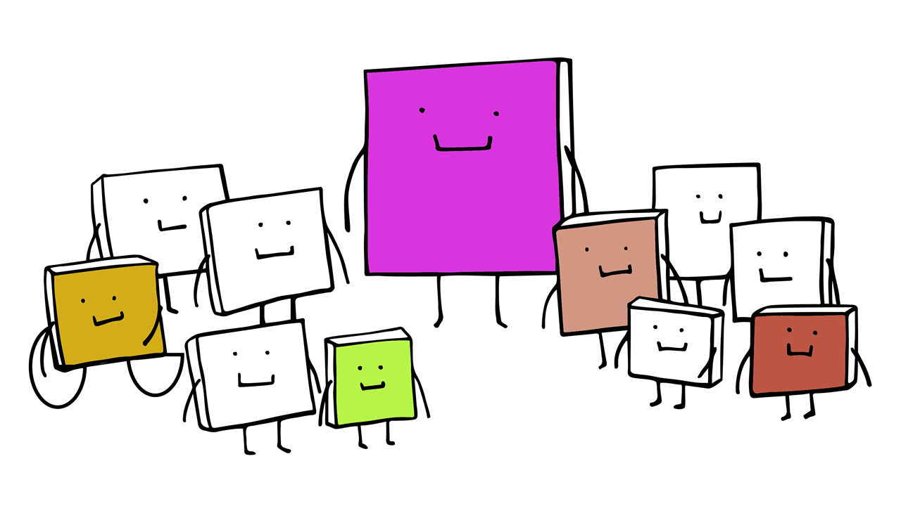

Let's start with this last major chapter focused on students and their individual differences. 

In chapter 2, we defined the fact of diversity - the variety and differences between individuals in a society - on three levels: social, biological, and psychological. Following this theoretical framework and interdisciplinary empirical research, we will now take a closer look at four dimensions of diversity and the special characteristics of students:

* Social origin (5.1)
* Ethic origin (5.3)
* Physical and cognitive abilities (5.5)
* Personality and gender (5.7) 

Each section contains a case vignette. Note that we deliberately refrain from distinguishing between general students and students with special education needs or at-risk-students wherever possible!

> __Learning Goals:__
>
> * You are able to describe the characteristics of student diversity in different dimensions.
> * You are able to appraise situations possibly involving discrimination in schools/lessons, analyse them from the students' point of view, and indicate and justify a course of action appropriate to the situation.

###	5.1 Socioeconomical Inequality

Sociologists examining the causes, mechanisms, and consequences of discrimination (see chapter 2) and social inequality focus on the impact of ascribed features of social status (like ethnicity or gender) and acquired attributes (like the level of education a person has reached). Inequality is social insofar as it arises through social processes. 

Finding a value-free definition of social inequality is challenging, however. One might say: "Social inequality exists when people have different levels of well-being" (Brüderl, 2019)[^1]. 

But this poses another problem, that of defining well-being. In that light, the following definition may be preferable:

> __Definition of Social Inequality__
>
> Social inequality exists when people have different levels of primary and/or secondary intermediate goods. Intermediate goods are dimensions of social inequality such as education or financial capital.” (translated from Brüderl, 2019)[^1]

Whether inequality is just or unjust is a separate question that will not be discussed here. For a common definition of social justice and an extended description of relevant concepts, theory, and praxis, see Abbott (2014)[^2].

> __Definition of Social Justice__
>
> Social justice is commonly viewed as a guiding principle to achieve a just society, understood both as a means and an end. It includes a wide variety of goals, including the full and equal participation of individuals in all institutions; fair and equitable distribution of material and non-material goods, and recognition and support for the needs and rights of individuals. (see Abbott, 2014; see also Bell, 2007)[^2][^3].

In general, sociologists distinguish ascriptive features such as origin, sex/gender, ethnicity, blood group, hair colour, age, etc. and acquired features such as occupation, education, income and wealth.
It is assumed that ascriptive features do not influence human well-being directly, but indirectly via primary and secondary intermediate goods.

Increasing Well-being
---

In principle, it can be assumed that more or better intermediate goods increase individual well-being (see the illustration following Brüderl, 2019)[^4].

 Increasing well-being. Own illustration based on Brüderl (2019)[^4]

 

This illustration does not claim to be complete. Where would you site migration/ethnicity and sex/gender?

International comparative research has shown time and again that these aspects are crucial factors affecting social and educational inequalities in societies today (OECD, 2024)[^5].

What You Will Find in the Next Section
---
In the next section we will take a closer look at four dimensions of diversity as well as four case-vignettes.

[^1]: Brüderl, J. (2019). Vorlesung Sozialstrukturanalyse. https://www.ls3.soziologie.uni-muenchen.de/studium-lehre/lehrmaterialien/ws-2019-2020/vorlesung-sozialstruktur_19.pdf

[^2]:Abbott, K. (2014). Social Justice. In A.C. Michalos (Ed.), Encyclopedia of Quality of Life and Well-Being Research. Springer. https://doi.org/10.1007/978-94-007-0753-5_2772

[^3]:Bell, L. A. (2007). Theoretical foundations for social justice education. In M. Adams (Ed.), Teaching for diversity and social justice (pp. 1–14). Routledge/Taylor & Francis Group.

[^4]:Brüderl, J. (2019). Soziale Ungleichheit. Vorlesung Sozialstrukturanalyse (Kapitel 4), LMU München, Germany. https://www.ls3.soziologie.uni-muenchen.de/studium-lehre/lehrmaterialien/ws-2019-2020/vorlesung-sozialstruktur_19.pdf 

[^5]:OECD. (2024). Education at a glance 2024: OECD indicators. OECD. https://doi.org/10.1787/c00cad36-en

### 5.2 Case Vignette 1: "Social Origin"

Take your time as you read and reflect on this story and remember: This is not a test with right or wrong answers but an exercise for thinking about your role as a teacher in a diverse classroom!

AI Image Gen generated image based on own prompt[^1]

 

> __"Social Origin" Case Description__
> 
> Tina, 14 years old, is a student in the 8th grade who lives in a rural area with her parents and her three younger brothers and attends school in a nearby city. Since her mother has fallen seriously ill and her father is now running the family business - a cheese dairy and a small hotel- without her mother, the family's finances have become increasingly strained. Tina now helps out as a server in the restaurant after school and only starts her homework late at night. She can barely keep her eyes open in class and she sits away from her friends during the breaks to rest. 
>
> As a teacher, you know nothing about the pressures Tina is under. However, she doesn't seem to be looking forward to the upcoming class trip at all. You are worried about her - and rightly so, because Tina then comes to you to let you know that she doesn't want to go on the picnic next week or on the school trip. She says she had a fight with her best friend - and this makes you think. 

Some Ways in Which You Could React:
---

> @admonition(warning, Task: )
> 
> Take a moment to think about your preferred course of action as the teacher. Reflect, too, on why you would choose your first-preferred reaction?
>
> * Seek contact with the parents
> * Accept Tina's decision without asking further questions
> * Try to motivate Tina to participate
> * Ask Tina and her friend to talk
> * Seek dialogue within the teaching staff
> * Other ideas?

You can also note other ideas separately and share them anonymously on the [public OER feedback wall](https://padlet.com/teacheredueuniwell/oerdiversityinclusion) in the "content" section.

[^1]: Photorealistic image of a tired 14-year-old girl in 8th grade, sitting at her desk in a bright classroom, looking worried, with droopy eyes, while classmates chat nearby. A calendar shows an upcoming class trip.

### 5.3 Ethnicity and Migration

Ethnic origin is systematically linked to various dimensions of inequality and can be operationalised in very different ways (does a person, for example, count as "belonging" to the country where they were born independently of their parents' citizenship rights?). This operationalisation based on a person's birthplace is particularly central in countries such as the USA or Canada that have a long tradition of accepting immigrants.

Which Groups are Affected by Ethnic Inequality? 
---

In many countries where mass immigration commenced later, however, the children of immigrants continue to be regarded as immigrants. This is particularly true in Germany, where ethnically defined concepts of nationality and citizenship prevailed for a long time and statistics still record that certain students have a so-called "migration background".

The "migration background" concept is controversial because of the overlap between the statistical definition and everyday experiences of belonging or being othered, although it undoubtedly represents an improvement on the distinction formerly made between supposedly autochthonous inhabitants and foreigners (Diehl, 2024)[^1].

It is undisputable that sensitive and inclusion-oriented teachers need to be aware of the well-being of their students and families. Reflecting on social and ethnic inequality and actively, proactively and reactively avoiding discrimination is a core task for inclusive pedagogy.

What You Will Find in the Next Section
----

You will encounter the case vignette "language and identity".

[^1]:Diehl, C. (2024). Migration und ethnische Ungleichheiten. In Handbuch Sozialstrukturanalyse (pp. 1–25). Springer Fachmedien Wiesbaden. https://doi.org/10.1007/978-3-658-39759-3_47-1 

### 5.4 Case Vignette 2: "Language and Identity"

Now, we now describe another case-vignette on the topic of migration and identity. Please take your time and remember: This is an exercise to reflect on your role as a teacher in different classrooms; it is not a test where you have to choose right or wrong answers! 

In Addition: If you are a person with an immigrant background, please imagine that the students (Hadil and Sol) presented in the following case have a different first language than you.

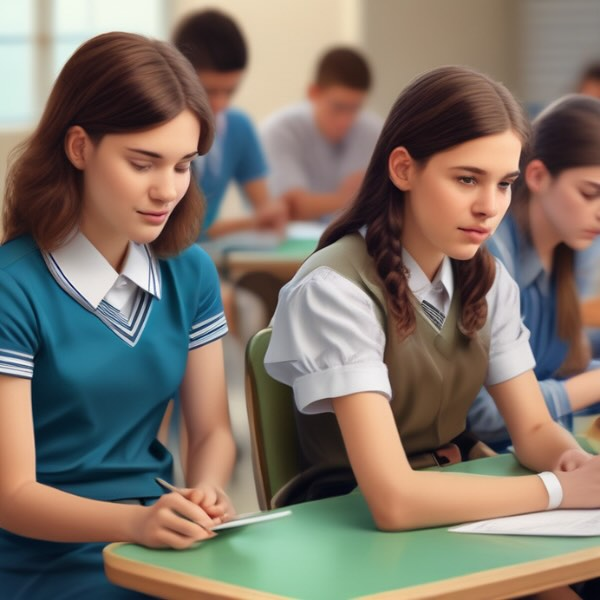AI Image Gen generated image based on own prompt[^1]

 

> __“Language” Case Description__
> 
> You are a class teacher at a secondary school that has a high proportion of pupils with a migrant background, while the socio-cultural diversity of your colleagues is rather rare. On the whole, you have the impression that the new students’ transition to school is successful and that they are well integrated after the first year. However, the case of Hadil and Sol, 16-year-old twins, is different. They have been in their class for 10 months, but they still remain alone and do not participate in school activities. They do not speak in the school language, even though they attend the additional language course. They are also silent in English lessons, even though they had English lessons in their home country. They always use a translator for exercises in the classroom and at home and their performance is generally good. However, there is no verbal communication in class, neither with their peers nor with you or other teachers. This is a major problem for social inclusion and educational success. 

Some Ways in Which You Could React
---

> @admonition(warning, Task: )
> 
> In the following, we present different fields of action. At first, you see some possible reaction with regard to your direct contact with Hadil and Sol. Please take your time and reflect on your role as a teacher in this situation. What would you do? Remember that this is not a test with right or wrong answers! 
> 
> __Your relation to Hadil and Sol:__
>
> * I stay out of it and do not speak to Hadil and Sol.
> * I use a translator to express my own opinion in Hadil and Sol's mother tongue and write to Hadil and Sol to ask them to change their behaviour.
> * Other reactions?
>
> __Your relation to your colleagues and others:__
>
> * I do not raise the issue with my colleagues.
> * I tell my colleagues about Hadil and Sol and request that we develop a social inclusion plan as a team.
> * I tell my family / friends about Hadil and Sol and reflecting the problem of inclusion.
> * I get in touch with the social education worker.
> * I get in touch with the school psychologist.
> * Other reactions?
>
> __Classroom management:__ 
> 
> * I continue to use the usual social forms and methods.
> * I try to use more co-operative social forms and multilingual activities that strengthen the class community.
> * I make the class aware that Hadil and Sol should be included more ,addressing their social exclusion openly in front of the class.
> * I follow the curriculum without explicitly addressing the topic of inclusion.
> * In order to sensitise the class, I combine the topics of the curriculum with the topic of inclusion.
> * Other reactions?
>
> __Your relation to the parents:__ 
> 
> * I stay out of it and do not seek contact with the parents. What happens at home is not my responsibility. The twins are old enough.
> * I use a translator writing a letter and provide information about help centres.
> * I seek dialogue with the parents and a professional interpreter.
> * Other reactions?

You can also note other reactions separately and share them anonymously on the [public OER feedback wall](https://padlet.com/teacheredueuniwell/oerdiversityinclusion) in the "content" section.

What You Will Find in the Next Section
---
In the next section we look at function, disability, and health.

[^1]: Photorealistic image of a classroom, in the foreground twin teenage sisters sitting next to each other looking at tablets. In the background, students are sitting.

###	5.5 Function, Disability, and Health

It is simply a fact that we are all individual humans with different physical and cognitive abilities.However, some individuals with physical and/or cognitive functions and structures that deviate from certain norms face particular disadvantages in everyday life. Medical diagnoses of disease and disability represent deviations from the norm of health.

International Classification of Function, Disability, and Health (ICF)
---

The International Classification of Function, Disability, and Health (ICF) developed by the World Health Organization (WHO) is a code book that explains health and related conditions in internationally standardised language. This enables worldwide communication about health and healthcare.

The components are described from the perspective of the body, the individual, and society in two main lists:

1. __Body functions and body structures__ 
2. __Activities and participation__ 

Accordingly, disability serves as a generic term for impairments of activity and participation.

The ICF also lists environmental factors that interact with the constructs mentioned above. This enables the user to create useful profiles of a person's functioning, disability, and health for different domains. Furthermore, the ICF systematically groups different domains for a person with a specific health problem (e.g. what can a person affected by a disease actually do?).

ICF Model, Garro, F., Chiappalone, M., Buccelli, S., De Michieli, L., & Semprini, M. (2021)[^1]

 

It is clear that it is crucial for teacher to be aware of and sensitive to students' individual (dis)abilities and their well-being. However, general education teachers in mainstream schools are not experts in medicine and special education diagnostics. Therefore, multi-professional cooperation and inter-professional co-teaching are needed as well as open, inclusive attitudes and general knowledge about some diseases and disabilities.

Last but not least, it is crucial to know, that we can find relevant information according to a special disease/disability in the [international version of the ICD-11 manual](https://icd.who.int/en). 
The manual offers basic knowledge in order to establish a common ground for the communication with special education teachers. 

Autism-Spectrum-Disorders
---

Due to the variety and diversity of autistic symptoms, the technical term autism spectrum disorders (ASD) is used; see code [6A02 in the ICD-11 Manual](https://icd.who.int/browse/2024-01/mms/en#437815624). The term “spectrum” shows the endeavour to do justice to the wide range of symptoms and typical characteristics as well as the different strengths and abilities, but also the impairments that the respective people with ASD can exhibit, see illustration below.

"Autism spectrum disorder is characterised by persistent deficits in the ability to initiate and to sustain reciprocal social interaction and social communication, and by a range of restricted, repetitive, and inflexible patterns of behaviour, interests or activities that are clearly atypical or excessive for the individual’s age and sociocultural context."(ICD-11, n.d)[^1]

What You Will Find in the Next Section
---
In the following, we present a case-vignette on another clinical picture; “obesity”

[^1]: Garro, F., Chiappalone, M., Buccelli, S., De Michieli, L., & Semprini, M. (2021). Neuromechanical Biomarkers for Robotic Neurorehabilitation. Frontiers in Neurorobotics, 15. https://doi.org/10.3389/fnbot.2021.742163

[^2]: ICD-11 for Mortality and Morbidity Statistics. (n.d.). Retrieved November 18, 2024, from https://icd.who.int/browse/2024-01/mms/en#437815624

### 5.6 Case Vignette 3: "Obesity"

Take your time as you read and reflect on this story and remember: This is not a test with right or wrong answers but an exercise for thinking about your role as a teacher in a diverse classroom!

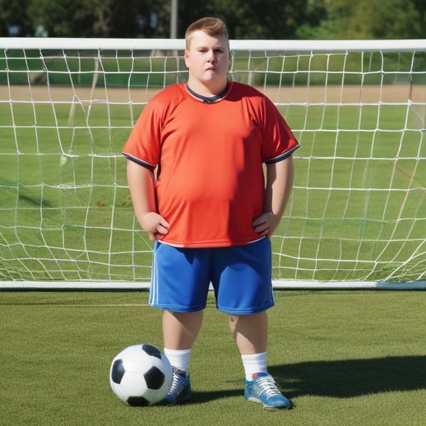AI Image Gen generated image based on own prompt[^1]

 

> __"Obesity" Case Description__
>
> Andy is 13 years old and has been attending the school where you are have been his sports teacher for a year now. Since changing schools, he has put on a lot of weight, and you are now very concerned about his health. In sports lessons, his body is more of a handicap than a strength. In addition, he is increasingly excluded by the other students and pushed into the goalkeeper role at soccer. You know from her that the parents seem unconcerned and rejected the advice to seek a consultation with an adolescent medicine doctor. His family''s lifestyle seems to be generally unhealthy and Andy is unlikely to be receiving the support he needs at home.

Some Ways in Which You Could React
---

> @admonition(warning, Task: )
> 
> Take a moment to think about your preferred course of action as the teacher. Reflect, too, on why you would choose your first-preferred reaction?
>
> __Do you often worry about Andy before the sports lesson? If so, how do you want to deal with it? (several options available)__
> 
> * Address the child's physical health with him directly 
> * Talk to the parents
> * Ignore the situation/wait for developments or until you are asked
> * Talk to colleagues about experiences and methods 
> * Talk about the case in your own personal environment, seek advice
> * Other
>
>__Imagine That Teams Have Been Chosen and that Andy Has Been Picked Last (and Reluctantly). How Do You Feel as a Teacher, on a Stress Scale of 1-5?__
>
> 0. My well-being is unimpacted
> 1. Very slightly stressed
> 2. Slightly stressed
> 3. Moderately stressed
> 4. Fairly stressed
> 5. Very stressed
>
> __Would You Keep the Team Selection Method in the Future?__
>
> * Yes, a different method would not change the situation for Andy. He will have to put up with it or fight back.
> * Yes, but I will reprimand the class.
> * No, I will choose a different method? Counting out, drawing lots, ...?
> * No, I will avoid team games and only focus on individual exercises in class.
>
>__Imagine Andy Standing in Goal and Being Insulted by Classmates ("You Fill the Whole Goal - It's Great That You Are So Fat!") How Do You Feel as a Teacher, on a Stress Scale of 1-5?__
>
> 0. My well-being is unimpacted
> 1. Very slightly stressed
> 2. Slightly stressed
> 3. Moderately stressed
> 4. Fairly stressed
> 5. Very stressed
>
> __What Feelings Do You Expect Andy to Have When Sports Class is Coming Up? Sort the points on a scale according to their strength 0 = not present at all, 1 = very slightly present, .... 5 = very strongly present.__
>
> * Anxiety (1-5)
> * Hope for friendships (1-5)
> * Insecurity (1-5)
> * Helplessness (1-5)
> * Anger that nobody takes him seriously in sports lessons (1-5) 

You can also note other reactions separately and share them anonymously on the [public OER feedback wall](https://padlet.com/teacheredueuniwell/oerdiversityinclusion) in the "content" section.

What You Will Find in the Next Section
---
In the next section we look at gender identity.

[^1]: Photorealistic image of 13 year-old overweight boy with a soccer ball, on a soccer field during PE class.". 

###	5.7 Gender Identity

We will now focus on two popular models from psychology research that describe general structures and characteristics of human personalities. Furthermore, we will also take a closer look at the construct of gender identity.

Gender Identity and Psychological Models of Personality
---

In general, gender refers to the attitudes, feelings, and behaviours that a given culture associates with a person's biological sex (APA, 2012)[^1]. Gender, sex and related terms are often conflated, and the language related to gender identity and sexual orientation has also evolved rapidly.

Gender identity is a component of gender that describes a person's psychological sense of their gender. Many people describe gender identity as a deeply felt, inherent sense of being a boy, a man, or male; a girl, a woman, or female; or a nonbinary gender (e.g., genderqueer, gender non-conforming, gender-neutral, agender, gender-fluid) that may or may not correspond to the sex assigned to a person at birth, the gender other people presume them to have, or their primary or secondary sexual characteristics. Gender identity is not limited to transgender or gender non-conforming individuals - all individuals have a gender identity (APA, 2020)[^2].

LGBTQIA+ Teachers: Challenges, Impact, and Policy
---

Scholars in educational research have addressed the challenges of exclusion and marginalisation faced by teachers who identify as lesbian, gay, bisexual, transgender, queer, intersex and asexual (LGBTQIA+). This research could also find out more about the benefits of a diverse teaching body. Whether or not they are open about their orientation, their presence and efforts can have a constructive impact on students' education and development.

Lundin (2024)[^3] examined narratives of LGBT teachers and related them to the general functions of education (i.e. qualification, socialisation, subjectification). It was found that teachers strive for development and change in order to disrupt heteronormativity.

That is, policy documents serve as a first step that requires additional comprehensive efforts in schools to address negative attitudes among adults and in the student-teacher relationship. The illustration presented below shows the three functions of school education and teachers’ narratives.

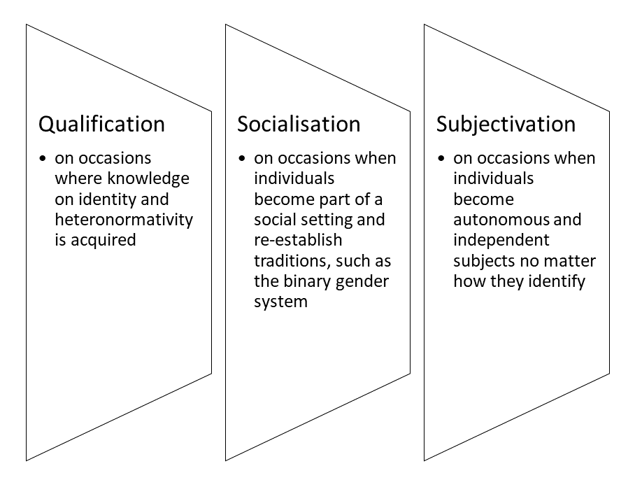Own illustration based on Lundin (2024)[^3]

 

What You Will Find in the Next Section
---
The last case-vignette describes a classroom situation involving a transgender student. 

[^1]:American Psychological Association. (2012). Guidelines for psychological practice with lesbian, gay, and bisexual clients. The American Psychologist, 67(1), 10–42. https://doi.org/10.1037/a0024659

[^2]:Publication manual of the American Psychological Association (7th ed.) (Vol. 7). (2020). American Psychological Association. https://doi.org/10.1037/0000165-000 

[^3]:Lundin, M. (2024). Heteronormativity in Swedish schools: making a difference as an LGBT teacher. Teachers and Teaching, 1–18. https://doi.org/10.1080/13540602.2024.2381045

### 5.8 Case Vignette 4: "Transgender"

Take your time as you read and reflect on this story and remember: This is not a test with right or wrong answers but an exercise for thinking about your role as a teacher in a diverse classroom!

AI Image Gen generated image based on own prompt[^1]

 

> __"Transgender" Case Description:__
>
> You are a 9th grade teacher at a rural school. A new school year is just beginning. You start teaching a new class group and find out on the first day that one student (the “Markus” on your list of names) does not identify with their biological sex. Their family is strictly religious and does not accept transgender people. Despite this upbringing, Markus decided during the summer holidays that they now want to be addressed only as Martina and to use female pronouns. The parents do not accept their son’s decision, so Markus/Martina now not only has internal conflicts due to their religiosity, but also external conflicts with their family.
>
> After the first few weeks of school together, you as a teacher notice that Martina is having difficulties in the class community and is becoming withdrawn. You fear that the situation is becoming overwhelming for your student. The internal conflicts caused by religion and the social conflicts with classmates and family members need to be regulated to avert the development of further problems such as a drop in school performance.

Some Ways in Which You Could React
---

> @admonition(warning, Task: )
> 
> Different fields of action are described here. Take a moment to think about your preferred course of action as the teacher in this situation with Markus/Martina. Reflect, too, on why you would choose your first-preferred reaction? 
>
> __The First Field of Action Concerns Your Dealings With Martina.__
>
> Choose the option that suits you best. This is about your own assessment.
> 
> * I stay out of it and don't talk to Martina about her problems.
> * In a conversation with Martina, I refer her to what I think are helpful resources or people who could provide her with support.
> * I share my own opinion and experiences with Martina.
> * Other
>
> __How Do You Behave Towards Martina?__ 
>
> * I make no active attempts to communicate with Martina individually.
> * I set up a box students can use to share concerns to me without having to address me directly. Then I can approach them.
> * I speak to Martina directly after the lesson.
> * Other
>
> __How Do You Deal With Other Teachers Who Also Teach Martina?__ 
> 
> * I don’t tell any of my colleagues what I know about Martina’s situation.
> * I make my colleagues aware that there is a transgender person in the class without saying that it is Martina.
> * I tell my colleagues about Martina and her situation.
> * Other
> 
> __How Do You Deal With the Class Community?__
> 
> * I continue to use the usual social forms and methods.
> * I try to use more cooperative social forms and activities that strengthen the class community.
> * I ask the class to be more accepting of Martina."I make the class aware that Martina should be more integrated.
> * Other
>
> __What is your approach to your future teaching?__
> 
> * I follow the curriculum without explicitly addressing the topic of transgender.
> * In order to sensitize the class, I combine the topics of the curriculum with the transgender issue.
> * I openly discuss Martina's case in front of the class.
> * Other
> 
> __How Do You Deal With Martina’s Parents?__
> 
> * I stay out of it and don’t seek contact with the parents.
> * What happens at home is not my responsibility.
> * I make an offer in writing that I can serve as a contact person and I provide information about other sources of help.
> * I seek direct contact with the parents.
> * Other

You can also note other reactions separately and share them anonymously on the [public OER feedback wall](https://padlet.com/teacheredueuniwell/oerdiversityinclusion) in the "content" section.

What You Will Find in the Next Section
---
You now come to the last sub-chapter of Students´ Diversity in Inclusive Classrooms that includes Universal factors of personality structure.

[^1]: Thin teenage boy with long hair sitting in classroom, transition to female identiy.

### 5.9 Universal factors of personality structure

People are diverse in personality. Being a sensitive teacher, it is important to know about general personality structures. According to the characteristics, you could be similar to some students while different to the others.

Two models discribe the universal personality structures, the Big-5 and the HEXACO Model.

Big-5 Model
---
The Big 5 Model has been scrutinised intensely by international research. Development of the model started in the 1930s with lexical approach studies based on the view that personality traits are reflected in language and that all essential differences between people are already represented in the dictionary by corresponding terms. 

This five-factors model is also called the __OCEAN-model__: (see Costa & McCrae, 1988; Costa et al., 2019)[^1][^2]

* __Openness:__ practical, prefers routine, comforting (low score); imaginative, prefers variety, independent (high score)

* __Conscientiousness:__ disorganized, careless, impulsive (low score); organized, careful, disciplined (high score)

* __Extraversion:__ retiring, sober, reserved (low score); sociable, affectionate, fun-loving (high score)

* __Agreeableness:__ ruthless, suspicious, uncooperative (low score); soft-hearted, trusting, helpful (high score)

* __Neuroticism:__ calm, secure, self-satisfied (low score); anxious, insecure, self-pitying (high score) 

HEXACO Model
---
The HEXACO model is based on Costa and McCrae’s Big Five. Adding the dimension Honesty-Modesty represented a significant extension to the HEXACO model (Ashton & Lee, 2007; Lee & Ashton, 2008).[^3][^4] This was also based on international research using the lexical 
approach and including several studies in Europe and Asia.

The HEXACO model includes six factors of human personality structures:

* __Honesty-Modesty__
* __Emotionality__
* __Extraversion__
* __Compatibility__
* __Conscientiousness__
* __Openness (to experience)__

The HEXACO questionnaire for assessing the personality is availble in many different languages.[^5]

Model Comparison
---

The following illustration based on empirical findings shows a comparison (Iller et al., 2021).[^6]

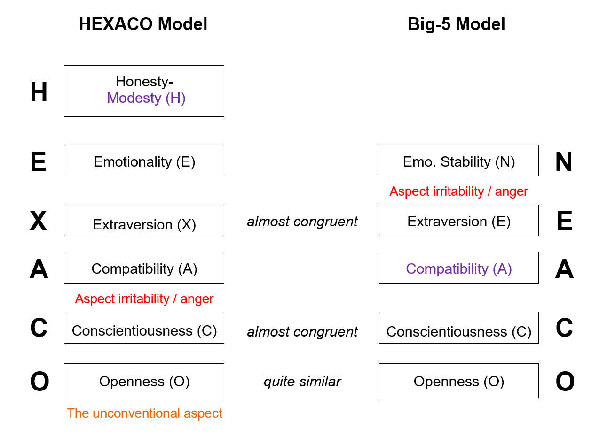HEXACO & Big-5 Model comparison llustration by Iller et al. (2021).[^6]

 

Try to be aware of your bias and reflect on your attitude, because research has shown that teacher personality affects student learning outcomes (e.g., Hattie, 2012)[^7].

[^1]:Costa, P. T., & McCrae, R. R. (1988). Personality in adulthood: A six-year longitudinal study of self-reports and spouse ratings on the NEO Personality Inventory. Journal of Personality and Social Psychology, 54(5), 853–863. https://doi.org/10.1037/0022-3514.54.5.853

[^2]:Costa, P. T., Jr, McCrae, R. R., & Löckenhoff, C. E. (2019). Personality across the life span. Annual Review of Psychology, 70(1), 423–448. https://doi.org/10.1146/annurev-psych-010418-103244

[^3]:Ashton, M. C., & Lee, K. (2007). Empirical, theoretical, and practical advantages of the HEXACO model of personality structure. Personality and Social Psychology Review: An Official Journal of the Society for Personality and Social Psychology, Inc, 11(2), 150–166. https://doi.org/10.1177/1088868306294907

[^4]:Lee, K., & Ashton, M. C. (2008). The HEXACO personality factors in the indigenous personality lexicons of English and 11 other languages. Journal of Personality, 76(5), 1001–1054. https://doi.org/10.1111/j.1467-6494.2008.00512.x

[^5]:Kibeom Lee, Ph.D., & Michael C. Ashton. (2009). THE HEXACO PERSONALITY INVENTORY - REVISED. Hexaco. https://hexaco.org/hexaco-inventory

[^6]:Iller, M.-L., Mäder, R., & Schreiber, M. (2021). Handbuch Fragebogen zur Erfassung der Persönlichkeit (HEXACO-PI-R1). Zürcher Hochschule für Angewandte Psychologie. https://laufbahndiagnostik.psychologie.zhaw.ch/downloads/de/Handbuch_HEXACO-PI-R1.pdf

[^7]:Hattie, John. (2012). Visible learning for teachers. Routledge. https://doi.org/10.4324/9780203181522

## 6. Final Quiz

Final Quiz Overview
---
* __10 Questions__ - With each new quiz attempt (and reload of the oer) the quiz will present 10 randomly selected questions from the question pool.
* __Passing Score__ - A minimum score of 80% is required to pass.
* __Unlimited Retry__ - You may retake the quiz as many times as needed to achieve the required score.
* __Certificate__ - Upon successful completion, a message will appear with a link to download your __Certificate of Achievement (PDF)__.

Good luck!

Final Quiz
---

<iframe src="https://euniwell.de.cool/wp-admin/admin-ajax.php?action=h5p_embed&id=40" width="898" height="843" frameborder="0" allowfullscreen="allowfullscreen" title="Final Quiz (Question Set)"></iframe>

Do You Need Help?
---
Please [contact us](mailto:teacheredu.euniwell@uni-konstanz.de) if you have sucessfully completed the final quiz but have troubles downloading the certificate. (Please attach a screenshot of the final result)

## 7. Unconscious Bias (Add-on)

The author of this chapter is [Dr. Sebastian Tillmann.](https://www.exc.uni-konstanz.de/en/ungleichheit/ueber-uns/personen/alle-clustermitglieder/tillmann-sebastian/)

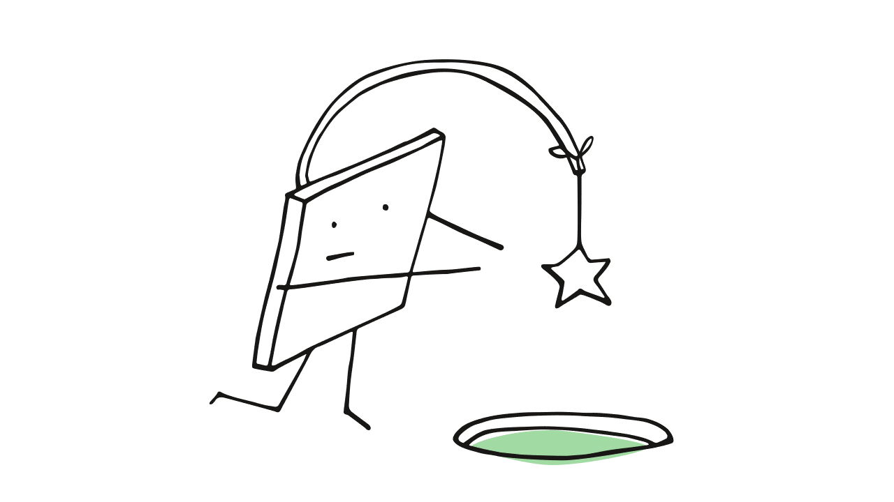

Why fair decisions are so important in everyday school life:
---

Studies show that triggers of unconscious biases, such as a student’s name or gender, often flow unnoticed into assessment processes and lead to unfair results (Malouff & Thorsteinsson, 2016).[^1] 
Such biases influence how we perceive and evaluate students – without us realising it.

But it doesn’t have to stay that way!
---
This chapter will help you to recognise and reduce these subtle influences so that your decisions remain fair and equitable. You will expand your knowledge of biases and learn how to minimise them in your everyday school life.

Whether you are a (future) teacher, school principal, or otherwise involved in education – you will find practical strategies that you can implement straight away here. In the next four sections, you will learn what bias is, where it occurs, and how you can make your decision-making fairer and more conscious. Practical exercises and reflection tasks will help you to integrate what you have learned directly into your everyday teaching.

> __Learning Goals__
> 
> * You will learn to recognise key features of unconscious bias.
> * You will find out which biases occur in the school environment.
> * You will learn through practical examples how biases can be avoided.

[^1]:Malouff, J. M., & Thorsteinsson, E. B. (2016). Bias in grading: A meta-analysis of experimental research findings. Australian Journal of Education, 60(3), 245–256. https://doi.org/10.1177/0004944116664618

### 7.1 What is Bias?

The term bias refers to distortions in information processing that influence our perception and decisions. In the teaching context, biases can influence the way teachers perceive and treat students.

The three main categories of bias are:
---

* __Preference Bias__

     This describes the favouring or disfavouring of certain groups, often based on stereotypes or prejudices (e.g gender bias). Men are favoured in physics and women in the social sciences (Bernstein et al., 2022)[^1]

* __Structural Bias__

     These are institutional patterns that unintentionally promote discrimination. One example is medicine, where drugs are often tested on men, leading to results that are inadequate for women (Criado-Perez, 2019)[^2]

* __Cognitive Bias__

    This comprises systematic errors in thinking that cloud our judgment, such as confirmation bias. Cognitive biases influence the ways in which information is perceived, processed and stored. They arise because our brain processes information selectively in order to make decisions efficiently (Gigerenzer & Brighton, 2009)[^3] In doing so, it uses heuristics that are fast but often inaccurate.

    *  __Dual Process Model of Cognition__

    Descriptions of cognitive biases draw on the dual process model of cognition (Kahneman, 2012)[^4]

       * __System 1__ works unconsciously and quickly but is prone to error.
        

    * __System 2__ thinks consciously and analytically, but requires more time and energy. 
        

    Bias often occurs in System 1, which processes this information intuitively, while System 2 is more cautious.

Minimizing Bias
---
To minimise bias, reflection and targeted training are necessary. Systematic analyses and organisational actions help to reduce preference and structural biases, while cognitive biases can be reduced through personal reflection and the conscious use of System 2.

[^1]:Bernstein, A. (2022). Gender Bias in Recommendation Letters for Academics. Journal of Social Psychology.
[^2]:Criado Perez, C. (2019). Invisible women: Exposing data bias in a world designed for men. Vintage Digital.
[^3]:Gigerenzer, G., & Brighton, H. (2009). Homo heuristicus: Why biased minds make better inferences. Topics in Cognitive Science, 1(1), 107–143. https://doi.org/10.1111/j.1756-8765.2008.01006.x
[^4]:Kahneman, D. (2012). Thinking, Fast and Slow. Penguin Books.

### 7.2 Bias in Information Uptake

Our senses are not perfect tools for perceiving reality. The brain selects some information for processing and filters out other information. We present two examples below where you can try this out for yourself.

Motion-Induced Blindness
----
If you focus on the flickering green dot in the animation graphic below for a few seconds, you will see the yellow static dots disappear and reappear.

Motion-induced blindness example[^2]

 

Peripheral Drift Illusion
----

Another example is the optical illusion of rotating snakes, a kind of peripheral drift illusion.
Although the image is static, it appears as if the “snakes” are moving:

 

Rotating snakes - Peripheral drift illusion example[^2]

 

How Our Percepion Can Distort Decision-Making
---
These examples illustrate that our senses distort information and it is easy to see how cognitive biases can distort our decision-making in similar ways.

In the example of motion-induced blindness, our brain deliberately filters out information by ignoring static elements in order to emphasise moving ones.

In contrast, in the case of the rotating snakes, the brain sees movement where none exists.
These phenomena exemplify how our perception is distorted by neurological mechanisms.
Our brain is limited in its processing capacity and makes quick, often erroneous decisions to prioritise and process information – an important insight when dealing with bias.

What You Will Find in the Next Section. 
---
In the next section we present four popular biases and give examples how they can influence decision making in school settings.

[^1]: Animation graphic by Cmglee, CC BY-SA 3.0, https://commons.wikimedia.org/w/index.php?curid=17583267
[^2]: Rotating Snakes peripheral drift illusion, based on design by Kitaoka Akiyoshi. Graphic by Mlechowicz, CC BY-SA 3.0, https://commons.wikimedia.org/w/index.php?curid=24513370

### 7.3 Bias in Information Processing

In everyday school life, teachers make countless decisions every day – from assessing students’ performance to evaluating their behaviour. These decisions can be influenced by various cognitive biases.

> __Confirmation Bias__
>
> Here, people tend to favour information that supports their pre-existing beliefs and opinions (Nickerson, 1998)[^1]. 
>
> This can also happen at school when teachers have positive or negative expectations of a student. Instead of objectively checking whether these expectations are justified, we unconsciously look for information that confirms our view and may ignore evidence to the contrary.
>
>> __For example__, a teacher may interpret a mediocre performance by a student who is considered gifted in a particular subject as exceptional and continue to assume that the student is fundamentally strong in this subject. In the same way, a student who the teacher believes to be weak in a particular subject could be judged more harshly even when they perform well.

> __Choice-Supportive Bias__
>
> Choice-supportive bias (Lind et al., 2017)[^2] is a tendency to retrospectively overestimate the positive aspects of an option after having chosen it. We tend to positively reinforce decisions we have made – when assessing students or choosing teaching methods – in retrospect.
>
>> __For example__, after introducing a new teaching method, a teacher may be inclined to perceive this method as more successful than it actually was, simply because they have already chosen it.This can lead to inadequate methods or approaches being retained instead of being critically questioned and adapted.

> __In-Group Bias__
>
> Another important bias that plays a role in schools is the in-group bias (Taylor & Doria, 1981)[^3]. Here, people tend to treat members of their own “group” better than outsiders.
>
> At school, this could lead to pupils who share similarities with the teacher – be it in terms of origin, interests or personality – being unconsciously favoured. This can influence the assessment of performance, but also behaviour towards students. Students who are perceived as “outsiders” may be unconsciously disadvantaged.

> __Mere-Exposure Effect__
>
> The mere-exposure effect is another source of bias of which we should be aware. Here, people evaluate other people or things that they encounter more frequently more positively (Serenko & Bontis, 2011)[^4]. 
>
> In everyday school life, this could mean that teachers perceive students with whom they have more interactions more positively than students who are quieter or more reserved.

Summary
---
These biases are deeply rooted in the way we process information. They occur because our brains need to process complex information quickly and efficiently. Although these mental shortcuts, known as heuristics (Tversky & Kahneman, 1973)[^5], help us to cope with everyday life, they can lead to unfair judgments in specific situations – especially when it comes to assessing students.
The challenge is to become aware of these biases and take action to minimise them. 

What You Will Find in the Next Section. 
---
Teachers can use various strategies to counteract their biases. We look at these in the next section.

[^1]:Nickerson, R. S. (1998). Confirmation bias: A ubiquitous phenomenon in many guises. Review of General Psychology: Journal of Division 1, of the American Psychological Association, 2(2), 175–220. https://doi.org/10.1037/1089-2680.2.2.175

[^2]:Lind, M., Visentini, M., Mäntylä, T., & Del Missier, F. (2017). Choice-supportive misremembering: A new taxonomy and review. Frontiers in Psychology, 8. https://doi.org/10.3389/fpsyg.2017.02062

[^3]:Taylor, D. M., & Doria, J. R. (1981). Self-serving and group-serving bias in attribution. The Journal of Social Psychology, 113(2), 201–211. https://doi.org/10.1080/00224545.1981.9924371

[^4]:Serenko, A., & Bontis, N. (2011). What’s familiar is excellent: The impact of exposure effect on perceived journal quality. Journal of Informetrics, 5(1), 219–223. https://doi.org/10.1016/j.joi.2010.07.005

[^5]: Tversky, A., & Kahneman, D. (1973). Availability: A heuristic for judging frequency and probability. Cognitive Psychology, 5(2), 207–232. https://doi.org/10.1016/0010-0285(73)90033-9

### 7.4 Reducing Bias in Communication

American Psychological Association (APA)
---

The American Psychological Association (APA) has stated its commitment both to the advancement of science and to the fair treatment of individuals and groups: As using inclusive language can foster the fair treatment of individuals and groups and the advancement of research, the American Psychological Association (APA) has made recommendations on bias-free language which are also of interest to educators:

“It is unacceptable to use constructions that might imply prejudicial beliefs or perpetuate biased assumptions against persons on the basis of age, disability, gender, participation in research, racial or ethnic identity, sexual orientation, socio-economic status, or some combination of these or other personal factors (e.g., marital status, immigration status, religion). Instead, authors should use affirming and inclusive language.” (APA, 2020, p.131)[^1].

Bias-Free Language Guidelines
---

The APA Editors have published Bias-free language guidelines[^2] that help people around the world in such disciplines as psychology, social work, communications, and education to achieve excellence in avoid bias in their writing. Some of the main ideas described by APA (2020)[^1] are highly applicable to efforts by teachers to use bias-free language in their verbal and written communication with students, parents, and their fellow professionals:

* __Talking about disability__

     Names of conditions such as “Asperger autism” and “Attention deficit disorder with hyperactivity” are more specific than “a student with disability” or “a student with special needs”.

* __Be sensitive to labels__

     Respect the language people use to describe themselves; that is, call people what they call themselves. You may need to ask your students which designations they use. Also, accept that language changes over time and that individuals within groups sometimes disagree about the designations they use.

* __Acknowledge people’s humanity__ 

     Ensure that the individuality and humanity of people are respected. Avoid using adjectives as nouns to label people (e.g., “the gays,” “the poor”) and using labels that equate people with their condition (e.g., “the learning disabled,” “the autistics”). Use adjectival forms (e.g., gay men, older adults) or nouns with descriptive phrases (e.g. people living in poverty, people with learning disabilities).

Overall, using sensitive, bias-free language is important in verbal and written communication as well as for professional teaching and being a social role model.

[^1]:Publication manual of the American Psychological Association (7th ed.) (Vol. 7). (2020). American Psychological Association. https://psycnet.apa.org/doi/10.1037/0000165-000 
[^2]: Bias-Free Language. (n.d.). American Psychological Association. Retrieved November 27, 2024, from https://apastyle.apa.org/style-grammar-guidelines/bias-free-language

### 7.5 Minimize Bias in Decision-Making

Although it is important to be aware of bias, knowledge alone is not enough to avoid bias (Bezrukova et al., 2016; Devine & Ash, 2021)[^1][^2]. This is because bias is often automatically activated by our fast decision-making system, System 1. 

__To minimise bias, it is important to consciously activate System 2__, but this can be exhausting and time-consuming. Taking practical steps to reduce bias in decision-making is nevertheless possible – especially in the school context, where fair assessments of students are important.

Methods for Bias Reduction
---

Using structured processes can minimise bias systematically and effectively. Examples of this in everyday school life are.

* __Anonymization of Exams:__ 

     When teachers do not know the names of students, the halo or horns effect, where previous performance could influence the assessment, is avoided.

* __Elimination of Irrelevant Information:__

     When evaluating performance, irrelevant information that could trigger personal bias should not be includedrecorded. Avoiding bias due to characteristics such as origin or gender can reduce in-group bias.
    
* __Using Clear Evaluation Criteria:__

     Structured and pre-defined criteria (e.g., for oral exams or project work) help to minimise subjective assessments. By defining clear benchmarks (e.g. on a scale from A to C or 1 to 6), it can be ensured that assessments are more objective and that there is less room for bias.

Group Decisions at School
---
Many important decisions in everyday school life – such as performance assessments or support measures – are made in groups. Such decisions are particularly susceptible to distortions such as social desirability bias or the influence of information cascades. These arise when influential group members express an opinion that others follow uncritically.

In a staff meeting to finalise grades, this could mean that the opinion of an experienced teacher could unconsciously influences everyone else and cause them to change their mind about the grade a student deserves, even if they originally disagreed. 

 __Decision Hygiene __

Kahneman et al. (2021)[^3] have coined the term “decision hygiene”, which describes strategies to reduce such biases in groups. This includes measures such as:

* __Independent Judgments:__ 

     Group members should express their opinions only after they have made their decisions independently. This avoids cascading effects.
    

* __Anonymous Voting:__

     To reduce social desirability bias, decisions should be made as anonymously as possible. This prevents individuals from changing their minds for social reasons just to suit the group.

* __Clear Evaluation Criteria and Structured Discussions:__ 

     To avoid group polarisation, discussions should be clearly structured and moderated. Groups tend to reinforce their opinions in discussions, which can lead to more extreme decisions than originally planned.

Practical steps for everyday school life
---

To reduce bias in the school decision-making process, several steps are useful:

* __Use pre-defined criteria:__

     Criteria should be defined before a decision is made and criteria should only consider relevant aspects of student performance.

* __Use assessment guidelines:__

     Structured guides, especially for oral exams or project assessments, help to minimise subjective bias.

* __Enable independent assessments:__

     Individual assessments should be completed prior to group sharing to minimise the influence of social dynamics.

* __Subsequent reflection:__

     After making a decision, teachers should consciously take time to question their own decision and reflect on possible biases. This can be supported in peer groups or through coaching.

Conclusion
---
Bias in decision-making can be effectively minimised by using structured processes and clear criteria and reducing social influence factors – an approach that ensures greater fairness both in individual performance and in group decisions in the school context.

What You Will Find in the Next Section
---
You can test your acquired knowledge about unconscious bias.

[^1]:Bezrukova, K., Spell, C. S., Perry, J. L., & Jehn, K. A. (2016). A meta-analytical integration of over 40 years of research on diversity training evaluation. Psychological Bulletin, 142(11), 1227–1274. https://doi.org/10.1037/bul0000067

[^2]:Devine, P. G., & Ash, T. L. (2022). Diversity training goals, limitations, and promise: A review of the multidisciplinary literature. Annual Review of Psychology, 73(1), 403–429. https://doi.org/10.1146/annurev-psych-060221-122215

[^3]:Kahneman, D., Sibony, O., & Sunstein, C. R. (2022). Noise: A flaw in human judgment. Little Brown and Company.

### 7.6 Summary Quiz

<iframe src="https://euniwell.de.cool/wp-admin/admin-ajax.php?action=h5p_embed&id=38" width="958" height="298" frameborder="0" allowfullscreen="allowfullscreen" title="Unconcious Bias (Question Set)"></iframe>

## Thank You! Your Feedback?

Thank You!
---
Thank you for taking the time and finishing our OER self-study module "Inclusion and Diversity in Education". 

Please Share Your Experience With Us.
---
We are committed to continuous improvement and would love to hear from you.

Please contact us directly via Email: [teacheredu.euniwell@uni-konstanz.de](mailto:teacheredu.euniwell@uni-konstanz.de)

Or post your note on our anonymous [feedback wall](https://padlet.com/teacheredueuniwell/oerdiversityinclusion).

Feedback Wall
-------------

<iframe src="https://padlet.com/embed/t9twf0p8n7gd2wo3" frameborder="0" allow="camera;microphone;geolocation" style="width:100%;height:608px;display:block;padding:0;margin:0"></iframe>

<a href="https://padlet.com?ref=embed" style="display:block;flex-grow:0;margin:0;border:none;padding:0;text-decoration:none" target="_blank">

</a>

## Bibliography

A-Z

Abbott, K. (2014). Social justice. In Encyclopedia of Quality of Life and Well-Being Research (pp. 6115–6119). Springer Netherlands.

American Psychological Association. (2012). Guidelines for psychological practice with lesbian, gay, and bisexual clients. The American Psychologist, 67(1), 10–42. https://doi.org/10.1037/a0024659

Ashton, M. C., & Lee, K. (2007). Empirical, theoretical, and practical advantages of the HEXACO model of personality structure. Personality and Social Psychology Review: An Official Journal of the Society for Personality and Social Psychology, Inc, 11(2), 150–166. https://doi.org/10.1177/1088868306294907

Asp-Onsjö, L. (2006). Åtgärdsprogram - dokument eller verktyg? En fallstudie i en kommun. https://gupea.ub.gu.se/handle/2077/16941

Bell, L. A. (2007). Theoretical foundations for social justice education. In M. Adams (Ed.), Teaching for diversity and social justice (pp. 1–14). Routledge/Taylor & Francis Group.

Bernstein, A. (2022). Gender Bias in Recommendation Letters for Academics. Journal of Social Psychology.

Bezrukova, K., Spell, C. S., Perry, J. L., & Jehn, K. A. (2016). A meta-analytical integration of over 40 years of research on diversity training evaluation. Psychological Bulletin, 142(11), 1227–1274. https://doi.org/10.1037/bul0000067

Bias-Free Language. (n.d.). American Psychological Association. Retrieved November 27, 2024, from https://apastyle.apa.org/style-grammar-guidelines/bias-free-language

Bronfenbrenner, U. (1977). Toward an experimental ecology of human development. The American Psychologist, 32(7), 513–531. https://doi.org/10.1037/0003-066x.32.7.513

Brüderl, J. (2019). Vorlesung Sozialstrukturanalyse. https://www.ls3.soziologie.uni-muenchen.de/studium-lehre/lehrmaterialien/ws-2019-2020/vorlesung-sozialstruktur_19.pdf

Bührmann, A. (2018). Diversität. Socialnet Lexikon. https://www.socialnet.de/lexikon/6324

Cambridge University Press. (n.d.). Meaning of discrimination in English. Cambridge Dictionary. Retrieved November 24, 2024, from https://dictionary.cambridge.org/dictionary/english/discrimination

Civitillo, S., Jugert, P., Yip, T., Lui, P. P., & Titzmann, P. F. (2024). A daily diary study on associations between school-based ethnic discrimination and school engagement. Social Psychology of Education: An International Journal. https://doi.org/10.1007/s11218-024-09919-x

Costa, P. T., Jr, McCrae, R. R., & Löckenhoff, C. E. (2019). Personality across the life span. Annual Review of Psychology, 70(1), 423–448. https://doi.org/10.1146/annurev-psych-010418-103244

Costa, P. T., & McCrae, R. R. (1988). Personality in adulthood: A six-year longitudinal study of self-reports and spouse ratings on the NEO Personality Inventory. Journal of Personality and Social Psychology, 54(5), 853–863. https://doi.org/10.1037/0022-3514.54.5.853

Criado Perez, C. (2019). Invisible women: Exposing data bias in a world designed for men. Vintage Digital.

Del Gobbo, Daniela Frison, André Bresges, Donna J. Dawkins, Jan Springob, Juan Antonio Solis Becerra, Ibolya Túri, Magali Hersant, Giovanna. (2023). Sustainability, health care, well-being, and inclusion: toward new professional standards for the teachers of the future. Nuova Secondaria , 5, 146–154.

Deutsches Institut für Menschenrechte, & UN-Behindertenrechtskonvention, M.-S. (2023). Parallel report to the UN Committee on the Rights of Persons with Disabilities for Germany’s 2nd/3rd State Party review procedure. 59. https://www.ssoar.info/ssoar/handle/document/88647

Devine, P. G., & Ash, T. L. (2022). Diversity training goals, limitations, and promise: A review of the multidisciplinary literature. Annual Review of Psychology, 73(1), 403–429. https://doi.org/10.1146/annurev-psych-060221-122215

Diehl, C. (2024). Migration und ethnische Ungleichheiten. In Handbuch Sozialstrukturanalyse (pp. 1–25). Springer Fachmedien Wiesbaden.

Education and Disability: Analysis of data from 49 countries. (2018, March 22). Unesco.org. https://uis.unesco.org/en/news/education-and-disability-analysis-data-49-countries

Ellis, D. P. (1968). SOCIOLOGICAL THEORY AND MODERN SOCIETY. By Talcott parsons. New York: The free press 1967. 564 pp. $12.50. Social Forces; a Scientific Medium of Social Study and Interpretation, 47(1), 90–91. https://doi.org/10.2307/2574723

Epp, A. (2017). Das ökosystemische Entwicklungsmodell als theoretisches Sensibilisierungs- und Betrachtungsraster für empirische Phänomene. https://doi.org/10.17169/fqs-19.1.2725

EUniWell. (n.d.). Our Alliance. European University for Well-Being. Retrieved November 19, 2024, from https://www.euniwell.eu/about/our-alliance

EUniWell. (2023). EUniWell Mission Statement. https://www.euniwell.eu/fileadmin/user_upload/Downloads/Key_documents/2023_EUniWell_Mission_Statement_-_updated.pdf

EUniWell Teacher Education Team. (n.d.). Arena 5: Teacher Education and Well-Being. European University for Well-Being. Retrieved Winter 11, 2024, from https://www.euniwell.eu/what-we-do/fields-of-action/arena-5-teacher-education-and-well-being

EUniWell, University of Florence. (2022). Deliverable Report (D3.27) Definition of common professional standards for European teachers.

Fend, H. (2009). Neue Theorie der Schule. VS Verlag für Sozialwissenschaften.

Florian, L. (2017). Teacher education for the changing demographics of schooling: Inclusive education for each and every learner. In Teacher education for the changing demographics of schooling (pp. 9–20). Springer.

Frederick, A., & Katz, J. H. (2002). The Inclusion Breakthrough: Unleashing the Real Power of Diversity Miller. Berrett-Koehler Punlishers, Inc.

Friend, M., Cook, L., Hurley-Chamberlain, D., & Shamberger, C. (2010). Co-teaching: An illustration of the complexity of collaboration in special education. Journal of Educational and Psychological Consultation: The Official Journal of the Association for Educational and Psychological Consultants, 20(1), 9–27. https://doi.org/10.1080/10474410903535380

Garro, F., Chiappalone, M., Buccelli, S., De Michieli, L., & Semprini, M. (2021). Neuromechanical Biomarkers for Robotic Neurorehabilitation. Frontiers in Neurorobotics, 15. https://doi.org/10.3389/fnbot.2021.742163

Gigerenzer, G., & Brighton, H. (2009). Homo heuristicus: Why biased minds make better inferences. Topics in Cognitive Science, 1(1), 107–143. https://doi.org/10.1111/j.1756-8765.2008.01006.x

Gomolla, M. (2008, February 18). Institutionelle Diskriminierung im Bildungs- und Erziehungssystem: Theorie, Forschungsergebnisse und Handlungsperspektiven. Heinrich Böll Stiftung. https://heimatkunde.boell.de/de/2008/02/18/institutionelle-diskriminierung-im-bildungs-und-erziehungssystem-theorie

Grosche, M. (2015). Was ist Inklusion? Ein Diskussions- und Positionsartikel zur Defi nition von Inklusion aus Sicht der empirischen Bildungsforschung. In P. Kuhl, P. Stanat, B. Lütje-Klose, C. Gresch, H. A. Pant, & M. Prenzel (Eds.), Inklusion von Schülerinnen und Schülern mit sonderpädagogischem Förderbedarf in Schulleistungserhebungen (pp. 17–39). Springer Fachmedien Wiesbaden. https://doi.org/10.1007/978-3-658-06604-8

Handbook for Teachers on Inclusive Education. (2020). Central Board of Secondary Education, Acedemic Unit. https://cdnbbsr.s3waas.gov.in/s3kv011a846fe7a5fa4b4b6d1eca45b228/uploads/2024/02/2024020919.pdf

Hattie, J. (2012). Visible learning for teachers. Routledge. https://doi.org/10.4324/9780203181522

Harper, D. (n.d.). Etymology of discriminate. Online Etymology Dictionary. Retrieved November 24, 2024, from https://www.etymonline.com/word/discriminate

ICD-11 for Mortality and Morbidity Statistics. (n.d.). Retrieved November 18, 2024, from https://icd.who.int/browse/2024-01/mms/en#437815624

Helle, H. J. (2001). Theorie der symbolischen Interaktion: ein Beitrag zum verstehenden Ansatz in Soziologie und Sozialpsychologie (3rd ed.). Düsseldorf: Westdeutscher.

Joas, H. (1989). Intersubjektivität – Die Entwicklung des Werkes von G. H. Mead. Berlin: Suhrkamp.

Jurkowski, S., Ulrich, M., & Müller, B. (2023). Co-teaching as a resource for inclusive classes: teachers’ perspectives on conditions for successful collaboration. International Journal of Inclusive Education, 27(1), 54–71. https://doi.org/10.1080/13603116.2020.1821449

Kahneman, D. (2012). Thinking, Fast and Slow. Penguin Books.

Kahneman, D., Sibony, O., & Sunstein, C. R. (2022). Noise: A flaw in human judgment. Little Brown and Company.

Kibeom Lee, Ph.D., & Michael C. Ashton. (2009). THE HEXACO PERSONALITY INVENTORY - REVISED. Hexaco. https://hexaco.org/hexaco-inventory

Köpfer, A., Powell, J. J. W., & Zahnd, R. (2021). Handbuch Inklusion international / International Handbook of Inclusive Education (A. Köpfer, J. J. W. Powell, & R. Zahnd, Eds.). Verlag Barbara Budrich.

Lee, K., & Ashton, M. C. (2008). The HEXACO personality factors in the indigenous personality lexicons of English and 11 other languages. Journal of Personality, 76(5), 1001–1054. https://doi.org/10.1111/j.1467-6494.2008.00512.x

Lind, M., Visentini, M., Mäntylä, T., & Del Missier, F. (2017). Choice-supportive misremembering: A new taxonomy and review. Frontiers in Psychology, 8. https://doi.org/10.3389/fpsyg.2017.02062

Lundin, M. (2024). Heteronormativity in Swedish schools: making a difference as an LGBT teacher. Teachers and Teaching, 1–18. https://doi.org/10.1080/13540602.2024.2381045

Lütje-Klose, B., Wild, E., Grüter, S., Gorges, J., Neumann, P., Papenberg, A., & Goldan, J. (2024). Kooperation in inklusiven Schulen: Ein Praxishandbuch zur Zusammenarbeit in multiprofessionellen Teams und mit Eltern. transcript Verlag.

Malouff, J. M., & Thorsteinsson, E. B. (2016). Bias in grading: A meta-analysis of experimental research findings. Australian Journal of Education, 60(3), 245–256. https://doi.org/10.1177/0004944116664618

Mead, G. H. (1934). Mind, self and society from the standpoint of a social behaviorist. University of Chicago Press. https://www.ssoar.info/ssoar/handle/document/50777

Nickerson, R. S. (1998). Confirmation bias: A ubiquitous phenomenon in many guises. Review of General Psychology: Journal of Division 1, of the American Psychological Association, 2(2), 175–220. https://doi.org/10.1037/1089-2680.2.2.175

OECD. (2024). Education at a glance 2024: OECD indicators. OECD. https://doi.org/10.1787/c00cad36-en

Popkewitz, T. S. (2004). Educational standards: Mapping who we are and are to become. The Journal of the Learning Sciences, 13(2), 243–256.

Publication manual of the American Psychological Association (7th ed.) (Vol. 7). (2020). American Psychological Association. https://doi.org/10.1037/0000165-000

Riccomini, P., & Witzel, B. (2010). Response to Intervention in Math. Corwin Press.

Serenko, A., & Bontis, N. (2011). What’s familiar is excellent: The impact of exposure effect on perceived journal quality. Journal of Informetrics, 5(1), 219–223. https://doi.org/10.1016/j.joi.2010.07.005

Stichweh, R. (2007). Inklusion und Exklusion in der Weltgesellschaft – Am Beispiel der Schule und des Erziehungssystems. In Intention und Funktion (pp. 113–120). VS Verlag für Sozialwissenschaften.

Studienseminar Hannover für das Lehramt für Sonderpädagogik. (n.d.). Handreichungen zur Ausbildung im gemeinsamen Unterricht. https://lehrerfortbildung-bw.de/s_sueb/alle/fb1/6_mat/3_zusammen/11_lit/Handreichungen-zur-Ausbildung-im-gemeinsamen-Unterrich.pdf

Sturm, T., & Wagner-Willi, M. (Eds.). (2018). Handbuch schulische Inklusion. utb GmbH.

Taylor, D. M., & Doria, J. R. (1981). Self-serving and group-serving bias in attribution. The Journal of Social Psychology, 113(2), 201–211. https://doi.org/10.1080/00224545.1981.9924371

Thomas, G. (2013). A review of thinking and research about inclusive education policy, with suggestions for a new kind of inclusive thinking. British Educational Research Journal, 39(3), 473–490. https://doi.org/10.1080/01411926.2011.652070

Tversky, A., & Kahneman, D. (1973). Availability: A heuristic for judging frequency and probability. Cognitive Psychology, 5(2), 207–232. https://doi.org/10.1016/0010-0285(73)90033-9

UN-CRPD (Committee on the Rights of Persons with Disabilities). (2016). General comment No. 4 on the right to inclusive education. Convention on the Rights of Persons with Disabilities. https://documents.un.org/doc/undoc/gen/g16/263/00/pdf/g1626300.pdf

UNESCO Global Education Monitoring Report Team, International Task Force on Teachers for Education. (2020). Inclusive teaching: preparing all teachers to teach all students. https://unesdoc.unesco.org/ark:/48223/pf0000374447

UNESCO. (2020). Global Education Monitoring Report 2020: Inclusion and education: All means all. Paris. UNESCO. https://doi.org/10.54676/jjnk6989

UNESCO. Assistant Director-General for Education, 2010-2018 (Qian Tang), & UNESCO. (2017). A Guide for ensuring inclusion and equity in education. UNESCO. https://doi.org/10.54675/mhhz2237

UNESCO, Institute for Statistics. (2018). Education and Disability: Analysis of Data from 49 Countries. https://uis.unesco.org/sites/default/files/documents/ip49-education-disability-2018-en.pdf

UNESCO, International Commission on the Futures of Education. (2021). Reimagining our futures together: a new social contract for education. UNESCO. https://doi.org/10.54675/asrb4722

Universität Rostock. (n.d.). The Response-to-Intervention Approach. Universität Rostock. Retrieved October 7, 2024, from https://www.rim.uni-rostock.de/en/response-to-intervention-approach/the-response-to-intervention-approach/

V. Aichele, LL.M., S. Bernot, C. Hübner, S. Kroworsch, B.Leisering, P. Litschke, L. Palleit, K. Pöllmann, J. Striek. (2019). Wer Inklusion will, sucht Wege Zehn Jahre UN-Behindertenrechtskonvention in Deutschland. Deutsche Institut für Menschenrechte, Monitoring-Stelle UN-Behindertenrechtskonvention. https://www.institut-fuer-menschenrechte.de/fileadmin/Redaktion/Publikationen/Wer_Inklusion_will_sucht_Wege_Zehn_Jahre_UN_BRK_in_Deutschland.pdf

van der Gaag, R. J. (2010). S. L. Odom, R. H. Horner, M. E. Snell, & J. Blacher (Eds.) (2007). Handbook of developmental disabilities. New York/Londen: Guilford Press. 645 p., isbn 978 1 5938 5485 0, $ 95,-. Kind en adolescent, 31(2), 104–105. https://doi.org/10.1007/bf03089708

Waack, S. (n.d.). Hattie effect size list - 256 Influences Related To Achievement. VISIBLE LEARNING. Retrieved October 7, 2024, from https://visible-learning.org/hattie-ranking-influences-effect-sizes-learning-achievement/

Walgenbach, K. (2021). Erziehungswissenschaftliche Perspektiven auf Vielfalt, Heterogenität, Diversity / Diversität, Intersektionalität. Verlag Julius Klinkhardt. https://doi.org/10.25656/01:22247

Wocken, H. (2009). Inklusion & Integration. Ein Versuch, die Integration vor der Abwertung und die Inklusion vor Träumereien zu bewahren. In Integration und Inklusion auf dem Wege ins Gemeinwesen (pp. 204–234). A.-D. Stein, I. Niediek, & S. Krach. https://inklusion20.de/material/inklusion/Inklusion%20vs%20Integration_Wocken.pdf

## Authors, Contact and Downloads

See [About this OER](#2)